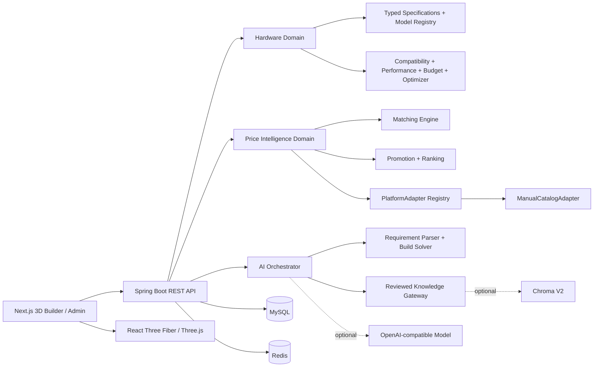

# PC LAB 3D

PC LAB 3D 是一个汽车配置器式的沉浸式电脑装机平台。当前产品基线为
`Builder UI V3.0 + Three.js Engine V2.0 + Hardware Intelligence V1.0 + Price Intelligence V1.0`：
Builder 从真实硬件 API 读取目录，硬件选择会同时驱动模块化 PC 场景、服务端兼容
检测、性能评分、预算状态、可解释优化建议与人工审核的购买情报。PC LAB 不销售商品；
价格能力只帮助用户比较到手价、可信度和购买时机。本阶段没有开发商城、社区或新的
AI 交互能力。

## 当前能力

- 八类硬件：CPU、GPU、主板、内存、硬盘、散热、电源、机箱
- React Three Fiber 模块化 PC 场景、360° 轨道控制与内部聚焦镜头
- GPU / CPU 卸载、安装、锁定与发光反馈，支持 Exploded 插槽连接线
- Airflow 冷热粒子路径与 RGB Studio 颜色、亮度、灯效和速度控制
- GLB / Draco / Meshopt / KTX2 加载管线、引用缓存、进度、错误与资源释放
- 桌面按需 60 FPS 目标、移动端自适应 DPR / 粒子预算与 30 FPS 降级目标
- Spring Boot 硬件数据中心、MySQL 迁移与 Redis 缓存
- CPU / GPU / 主板 / 内存 / 硬盘 / 散热 / 电源 / 机箱的分类规格与 3D 模型绑定
- `/hardware` 技术数据库：关键词、品牌、分类、价格、性能、功耗过滤与排序
- 服务端兼容规则：插槽、内存代际、显卡净空、散热能力、机箱规格与电源余量
- Gaming / Creator / AI 三类性能评分、瓶颈提示和服务端权威预算分析
- Builder 实时价格、剩余预算、功耗、兼容性、性能与显式“建议后应用”优化流程
- `/admin/hardware` 硬件档案、模型变换和兼容规则管理工作区
- 自有 `product` 商品库与多平台人工报价
- 商品标题标准化、硬件匹配置信度与可解释结果
- 优惠券、满减、会员优惠、平台补贴、运费的到手价计算
- 最低价与可靠商家分离排序，并显示价差与推荐理由
- Builder 比价面板、7/30/90 天 SVG 趋势图、浏览器匿名目标价提醒和购买跳转记录
- `/admin/prices` 商品、报价、匹配与价格运营控制台
- 自然语言需求解析、预算优化、依赖升级与逐组件推荐理由
- 规则优先的 AI 成本路由、MySQL 知识检索与可选 Chroma 向量检索
- Builder 右下角 AI Diagnostic Port，方案确认后才更新 3D 装机状态
- `/admin/ai` Prompt 版本、知识、推荐规则与隐私化请求日志控制台
- Admin Key、参数校验、限流、Trace ID、跳转域名白名单与统一异常响应

AI V1 默认完全使用本地规则与审核数据，OpenAI-compatible LLM 和 Chroma 均为
显式可选能力；关闭或故障时不会阻断装机。价格 V1 仍只使用人工维护数据，
不调用电商开放 API，不运行爬虫。

## 系统结构



技术基线：

- Frontend：Next.js 16、React 19、TypeScript、Zustand、React Three Fiber
- Backend：Spring Boot 3、Java 21、MyBatis Plus、Flyway
- Data：MySQL、Redis

完整 AI 架构、Prompt、RAG、接口、UI 与数据流见
[AI Builder V1 规格](docs/superpowers/specs/2026-08-01-pc-lab-ai-builder-v1-design.md)；
价格领域见
[Price Intelligence V1 规格](docs/superpowers/specs/2026-07-31-pc-lab-price-intelligence-v1-design.md)；
本阶段的数据库、规则引擎、API 与 UI 边界见
[Hardware Intelligence V1 规格](docs/superpowers/specs/2026-08-01-pc-lab-hardware-intelligence-v1-design.md)。

## 本地启动

前置条件：Java 21、Maven、Node.js、pnpm、MySQL 8（或兼容的新版本）、Redis。

1. 启动 MySQL 与 Redis。Flyway 会创建或升级 `pc_lab_3d`，保留原有内部
   价格并迁移为只读的 `INTERNAL` 参考报价。

2. 在 PowerShell 启动后端：

   ```powershell
   $env:PC_LAB_DB_USERNAME = "root"
   $env:PC_LAB_DB_PASSWORD = "replace-with-your-local-db-password"
   $env:PC_LAB_ADMIN_KEY = "change-this-local-key"
   $env:PC_LAB_ANALYTICS_HASH_KEY = "change-this-price-hmac-key"
   $env:PC_LAB_AI_ANALYTICS_HASH_KEY = "change-this-ai-hmac-key"
   mvn -f backend/pom.xml spring-boot:run
   ```

   后端默认运行在 `http://127.0.0.1:8088`，健康检查为
   `http://127.0.0.1:8088/actuator/health`。

3. 新开 PowerShell 启动前端：

   ```powershell
   pnpm install
   pnpm dev
   ```

   前端默认运行在 `http://127.0.0.1:3000`。Builder 位于 `/builder`，硬件数据库
   位于 `/hardware`，硬件管理台位于 `/admin/hardware`；既有价格与 AI 运营台位于
   `/admin/prices`、`/admin/ai`。运营台要求输入与后端一致的 Admin Key；密钥只
   保存在当前标签页的 `sessionStorage`，不会写入 URL 或长期本地存储。

### 可选模型与向量检索

默认无需外部 AI 服务。需要增强复杂自然语言解析时，再配置：

```powershell
$env:PC_LAB_AI_MODEL_ENABLED = "true"
$env:PC_LAB_AI_MODEL_BASE_URL = "https://your-openai-compatible-host"
$env:PC_LAB_AI_MODEL_API_KEY = "your-key"
$env:PC_LAB_AI_MODEL_NAME = "your-model"
```

需要 Chroma V2 语义检索时，设置 `PC_LAB_AI_VECTOR_ENABLED=true`、
`PC_LAB_AI_VECTOR_BASE_URL` 与 `PC_LAB_AI_VECTOR_COLLECTION_ID`。模型密钥与向量
Token 只配置在后端；前端永远不接触这些凭据。每日 Token 预算、超时和降级行为
可通过 `PC_LAB_AI_DAILY_TOKEN_BUDGET`、`PC_LAB_AI_TIMEOUT_MILLIS` 调整。

### 同源代理模式

默认 `.env.example` 让浏览器直连 `http://127.0.0.1:8088/api`。部署时也可让
Next.js 代理后端：

```powershell
$env:PC_LAB_BACKEND_ORIGIN = "http://127.0.0.1:8088"
$env:NEXT_PUBLIC_PC_LAB_API_URL = "https://your-domain.example/backend-api"
pnpm build
pnpm start
```

`/backend-api/**` 会代理到后端 `/api/**`，购买跳转仍经过价格服务记录点击并
校验目标域名，不直接暴露数据库中的联盟链接。

## 主要 API

| 能力 | 方法与路径 |
|---|---|
| 硬件搜索/过滤 | `GET /api/hardware` |
| 硬件详情 | `GET /api/hardware/{idOrKey}` |
| 独立兼容检查 | `GET /api/compatibility/check` |
| 配置权威分析 | `POST /api/build/analyze` |
| 预算约束优化 | `POST /api/build/optimize` |
| 配置保存/读取 | `POST /api/build`、`GET /api/build/{publicId}` |
| AI 生成装机方案 | `POST /api/ai/build` |
| 硬件价格摘要 | `GET /api/price-intelligence/hardware/{idOrKey}` |
| 7/30/90 天趋势与报价变更明细 | `GET /api/price-intelligence/hardware/{idOrKey}/history` |
| 整机报价 | `POST /api/price-intelligence/build/quote` |
| 目标价提醒 | `GET /api/price-intelligence/alerts`、`PUT /api/price-intelligence/alerts/{hardwareKey}`、`DELETE /api/price-intelligence/alerts/{publicId}` |
| 搜索事件 | `POST /api/price-intelligence/search-events` |
| 受控购买跳转 | `GET /api/price-intelligence/offers/{offerId}/go` |
| Admin 商品 CRUD | `/api/admin/products/**` |
| Admin 硬件档案 | `GET/POST /api/admin/hardware`、`GET/PUT/DELETE /api/admin/hardware/{id}` |
| Admin 3D 模型 | `POST /api/admin/hardware/{id}/models`、`PUT /api/admin/models/{id}` |
| Admin 性能与兼容规则 | `PUT /api/admin/hardware/{id}/performance`、`/api/admin/compatibility-rules/**` |
| Admin 报价维护 | `/api/admin/products/{id}/offers`、`/api/admin/offers/**` |
| Admin 价格概览 | `GET /api/admin/price-dashboard` |
| Admin AI 概览 | `GET /api/admin/ai/dashboard` |
| Admin Prompt 版本 | `GET /api/admin/ai/prompts`、`POST /api/admin/ai/prompts/{key}/versions` |
| Admin 知识与向量同步 | `/api/admin/ai/knowledge/**` |
| Admin 推荐规则与日志 | `/api/admin/ai/rules/**`、`GET /api/admin/ai/logs` |

所有 `/api/admin/**` 请求必须携带 `X-Admin-Key`。公共响应不会返回原始商品
链接或联盟链接，只返回受控跳转路径。AI 请求日志只保存哈希、结构化意图、路由、
耗时与结果，不保存原始对话文本。

## 价格数据规则

- `INTERNAL`：由历史硬件目录价迁移，仅作为内部参考价，在价格运营台只读。
- `MANUAL`：运营人员维护的平台商品与报价，可经过审核后进入 Builder。
- `LIVE`：为后续联盟开放平台预留；V1 没有启用任何真实平台适配器。
- 最低价只表示满足库存、匹配、时效和链接安全门槛后的最低到手价。
- 可靠推荐综合价格、销量、评价和店铺信誉，不以最低价冒充最佳选择。
- 目标价提醒使用浏览器生成的匿名 owner，仅通过 `X-Price-Alert-Owner` 请求头传递；
  V1 只在 Builder 内显示监测中/已达标，不承诺邮件、短信或系统推送。
- 定时任务只处理已审核的人工报价、历史快照与提醒状态，不访问或抓取电商网页。

## 验证命令

```powershell
pnpm verify
mvn -f backend/pom.xml test
```

生产构建：

```powershell
pnpm build
pnpm start
```

当前仓库未提交第三方商业 GLB。`public/models/README.md` 定义生产资源规范；在模型
登记为 `source: "glb"` 前，Builder 使用模块化程序几何占位模型，避免缺失资源 404。

## 后续扩展边界

- 新增 `JdAllianceAdapter`、`TaobaoAllianceAdapter`、`PddOpenPlatformAdapter`
  即可接入开放平台，不需要改写 Builder 比价契约。
- 不建议对浏览器端代码承诺“无法逆向”。正式商业化时应把定价规则、联盟密钥、
  风控与授权逻辑留在后端，并配合产物混淆、Source Map 管控、接口签名、限流、
  WAF、完整性校验与版权水印做分层保护。
