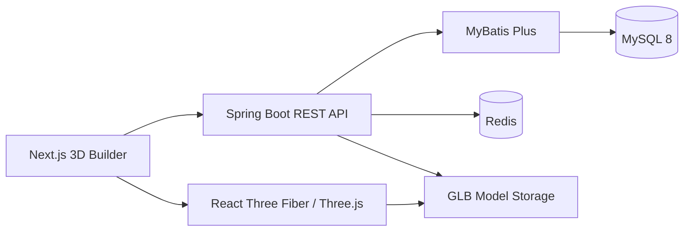

# PC LAB 3D

PC LAB 3D 是一个汽车配置器式的沉浸式电脑装机平台。本仓库当前交付
`Hardware Platform V1.0`：前端 Builder 已从本地模拟数据切换到
Spring Boot 硬件数据中心，并能实时联动 3D 场景、价格、功耗、性能、
兼容状态与配置保存。

## 当前能力

- 八类硬件：CPU、GPU、主板、内存、硬盘、散热、电源、机箱
- 22 条可用种子硬件与独立规格表
- 3D 模型元数据、GLB 上传与变换参数管理
- 硬件搜索、品牌/价格/性能过滤与分页
- Builder 实时价格、功耗、性能与兼容性计算
- 配置保存、公开 ID 读取与 LocalStorage 离线副本
- Redis 列表/详情/热门硬件/配置缓存
- Admin Key、参数校验、限流、Trace ID 与统一异常响应

## 系统结构



技术基线：

- Frontend：Next.js 16、React 19、TypeScript、Zustand、React Three Fiber
- Backend：Spring Boot 3、Java 21、MyBatis Plus、Flyway
- Data：MySQL 8、Redis

完整数据库字段、API 契约、缓存策略和 Admin CMS 页面设计见
[PC LAB 3D Hardware Platform V1.0](docs/superpowers/specs/2026-07-31-pc-lab-hardware-platform-v1-design.md)。

## 本地启动

前置条件：Java 21、Maven、Node.js、pnpm、MySQL 8、Redis。

1. 启动 MySQL 与 Redis。数据库无需手工建表，Flyway 会创建
   `pc_lab_3d`、14 张业务表并写入种子数据。

2. 在 PowerShell 配置后端运行变量：

   ```powershell
   $env:PC_LAB_DB_USERNAME = "root"
   $env:PC_LAB_DB_PASSWORD = "root"
   $env:PC_LAB_ADMIN_KEY = "change-this-local-key"
   mvn -f backend/pom.xml spring-boot:run
   ```

   后端默认运行在 `http://127.0.0.1:8088`，健康检查为
   `http://127.0.0.1:8088/actuator/health`。

3. 新开 PowerShell 启动前端：

   ```powershell
   pnpm install
   pnpm dev
   ```

   前端默认运行在 `http://127.0.0.1:3000`，并请求
   `http://127.0.0.1:8088/api`。如需改地址，复制 `.env.example`
   为 `.env.local` 后修改。

## 主要 API

| 能力 | 方法与路径 |
|---|---|
| 硬件搜索/过滤 | `GET /api/hardware` |
| CPU / GPU 列表 | `GET /api/hardware/cpu`、`GET /api/hardware/gpu` |
| 硬件详情 | `GET /api/hardware/{idOrKey}` |
| 分类 | `GET /api/categories` |
| 3D 模型元数据 | `GET /api/model/{idOrKey}` |
| 价格 | `GET /api/prices/{idOrKey}` |
| 保存/读取配置 | `POST /api/build`、`GET /api/build/{publicId}` |
| Admin 硬件 CRUD | `/api/admin/hardware/**` |
| Admin 模型/分类 | `/api/admin/models/**`、`/api/admin/categories` |

所有 `/api/admin/**` 请求必须携带 `X-Admin-Key`。当前价格来自自有数据库，
尚未接入淘宝、京东或拼多多。

## 验证命令

```powershell
pnpm verify
pnpm backend:test
```

生产构建：

```powershell
pnpm build
pnpm start
```
