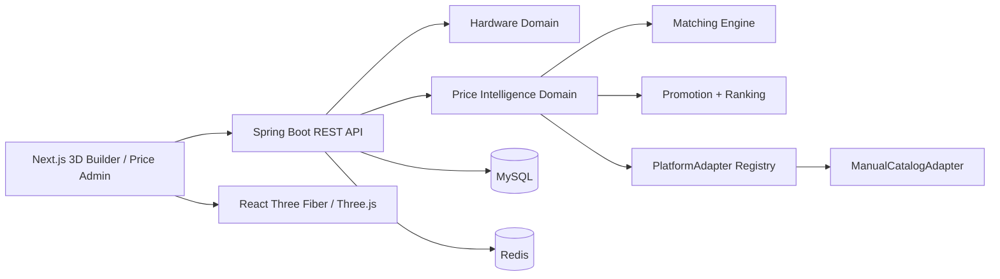

# PC LAB 3D

PC LAB 3D 是一个汽车配置器式的沉浸式电脑装机平台。当前仓库已完成
`Price Intelligence System V1.0`：Builder 在实时联动 3D 场景、兼容性、
性能与内部配置价的基础上，增加了人工商品库、跨平台比价、7/30 天价格
趋势、可靠商家推荐与受控购买跳转。

## 当前能力

- 八类硬件：CPU、GPU、主板、内存、硬盘、散热、电源、机箱
- React Three Fiber 3D 装机、零件替换、爆炸视图与 RGB 控制
- Spring Boot 硬件数据中心、MySQL 迁移与 Redis 缓存
- Builder 实时价格、功耗、性能、兼容性与配置保存
- 自有 `product` 商品库与多平台人工报价
- 商品标题标准化、硬件匹配置信度与可解释结果
- 优惠券、满减、会员优惠、平台补贴、运费的到手价计算
- 最低价与可靠商家分离排序，并显示价差与推荐理由
- Builder 比价面板、7/30 天 SVG 趋势图和购买跳转记录
- `/admin/prices` 商品、报价、匹配与价格运营控制台
- Admin Key、参数校验、限流、Trace ID、跳转域名白名单与统一异常响应

V1 仅使用人工维护数据，不调用淘宝、京东或拼多多开放 API，不运行爬虫。
界面会明确标注人工数据与演示报价，避免伪装成实时平台价格。

## 系统结构



技术基线：

- Frontend：Next.js 16、React 19、TypeScript、Zustand、React Three Fiber
- Backend：Spring Boot 3、Java 21、MyBatis Plus、Flyway
- Data：MySQL、Redis

完整领域、数据库、算法、安全与商业规则见
[Price Intelligence V1 规格](docs/superpowers/specs/2026-07-31-pc-lab-price-intelligence-v1-design.md)。

## 本地启动

前置条件：Java 21、Maven、Node.js、pnpm、MySQL、Redis。

1. 启动 MySQL 与 Redis。Flyway 会创建或升级 `pc_lab_3d`，保留原有内部
   价格并迁移为只读的 `INTERNAL` 参考报价。

2. 在 PowerShell 启动后端：

   ```powershell
   $env:PC_LAB_DB_USERNAME = "root"
   $env:PC_LAB_DB_PASSWORD = "replace-with-your-local-db-password"
   $env:PC_LAB_ADMIN_KEY = "change-this-local-key"
   mvn -f backend/pom.xml spring-boot:run
   ```

   后端默认运行在 `http://127.0.0.1:8088`，健康检查为
   `http://127.0.0.1:8088/actuator/health`。

3. 新开 PowerShell 启动前端：

   ```powershell
   pnpm install
   pnpm dev
   ```

   前端默认运行在 `http://127.0.0.1:3000`，Builder 位于 `/`，价格运营台
   位于 `/admin/prices`。运营台要求输入与后端一致的 Admin Key；密钥只保存在
   当前标签页的 `sessionStorage`，不会写入 URL 或长期本地存储。

### 同源代理模式

默认 `.env.example` 让浏览器直连 `http://127.0.0.1:8088/api`。部署时也可让
Next.js 代理后端：

```powershell
$env:PC_LAB_BACKEND_ORIGIN = "http://127.0.0.1:8088"
$env:NEXT_PUBLIC_PC_LAB_API_URL = "https://your-domain.example/backend-api"
pnpm build
pnpm start
```

`/backend-api/**` 会代理到后端 `/api/**`，购买跳转仍经过价格服务记录点击并
校验目标域名，不直接暴露数据库中的联盟链接。

## 主要 API

| 能力 | 方法与路径 |
|---|---|
| 硬件搜索/过滤 | `GET /api/hardware` |
| 硬件详情 | `GET /api/hardware/{idOrKey}` |
| 配置保存/读取 | `POST /api/build`、`GET /api/build/{publicId}` |
| 硬件价格摘要 | `GET /api/price-intelligence/hardware/{idOrKey}` |
| 7/30 天趋势与报价变更明细 | `GET /api/price-intelligence/hardware/{idOrKey}/history` |
| 整机报价 | `POST /api/price-intelligence/build/quote` |
| 搜索事件 | `POST /api/price-intelligence/search-events` |
| 受控购买跳转 | `GET /api/price-intelligence/offers/{offerId}/go` |
| Admin 商品 CRUD | `/api/admin/products/**` |
| Admin 报价维护 | `/api/admin/products/{id}/offers`、`/api/admin/offers/**` |
| Admin 价格概览 | `GET /api/admin/price-dashboard` |

所有 `/api/admin/**` 请求必须携带 `X-Admin-Key`。公共响应不会返回原始商品
链接或联盟链接，只返回受控跳转路径。

## 价格数据规则

- `INTERNAL`：由历史硬件目录价迁移，仅作为内部参考价，在价格运营台只读。
- `MANUAL`：运营人员维护的平台商品与报价，可经过审核后进入 Builder。
- `LIVE`：为后续联盟开放平台预留；V1 没有启用任何真实平台适配器。
- 最低价只表示满足库存、匹配、时效和链接安全门槛后的最低到手价。
- 可靠推荐综合价格、销量、评价和店铺信誉，不以最低价冒充最佳选择。

## 验证命令

```powershell
pnpm verify
pnpm backend:test
```

生产构建：

```powershell
pnpm build
pnpm start
```

## 后续扩展边界

- 新增 `JdAllianceAdapter`、`TaobaoAllianceAdapter`、`PddOpenPlatformAdapter`
  即可接入开放平台，不需要改写 Builder 比价契约。
- 不建议对浏览器端代码承诺“无法逆向”。正式商业化时应把定价规则、联盟密钥、
  风控与授权逻辑留在后端，并配合产物混淆、Source Map 管控、接口签名、限流、
  WAF、完整性校验与版权水印做分层保护。
