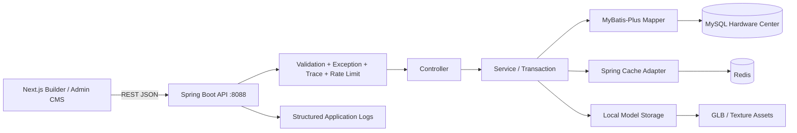
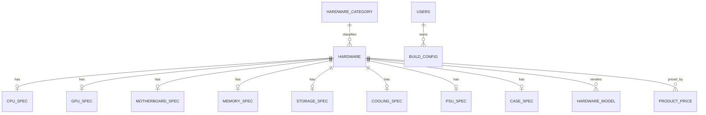
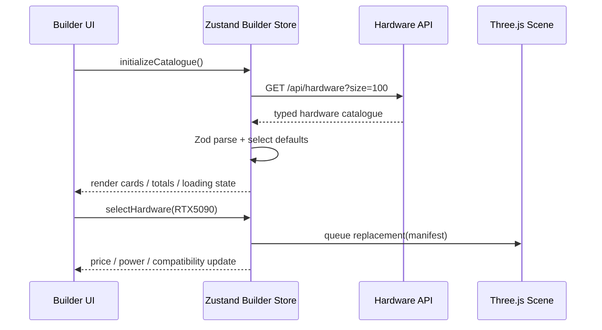

# PC LAB 3D Hardware Platform V1.0

> 状态：已批准实施  
> 日期：2026-07-31  
> 适用角色：后端工程师、数据库工程师、前端工程师、Three.js 工程师、运维工程师

## 1. 产品目标与范围

Hardware Platform V1.0 将现有 Builder 的静态硬件目录升级为真实数据中心：

- 管理 CPU、GPU、主板、内存、SSD、HDD、散热、电源、机箱。
- 向 Builder 提供分页、搜索、过滤、详情、规格、3D 模型和内部价格数据。
- 保存与读取装机方案。
- 为后台 CMS 提供硬件、规格、模型和价格管理接口。
- 通过 Redis 缓存高频读取，通过 Flyway 管理数据库版本。
- 前端运行时以 REST API 为唯一生产数据源；Mock 仅保留为测试夹具。

V1.0 不接入淘宝、京东、拼多多，不实现支付、订单、AI 聊天、用户登录与商城。

## 2. 技术基线

| 层级 | 技术 |
| --- | --- |
| Backend | Spring Boot 3.5.16、Java 21、Spring MVC |
| ORM | MyBatis-Plus 3.5.17 |
| Database | MySQL 8 兼容 SQL；本机联调使用 MySQL 9.6 |
| Migration | Flyway |
| Cache | Spring Data Redis、Redis 5+ |
| Validation | Jakarta Bean Validation |
| API | RESTful JSON，前缀 `/api` |
| Build | Maven 3.9+ |
| Frontend | Next.js 16、React 19、TypeScript、Zod、Zustand |
| Local ports | Frontend `3000`，Backend `8088`，MySQL `3306`，Redis `6379` |

数据库口令、Redis 口令与 Admin Key 只通过环境变量注入，不提交到 Git。

## 3. 总体系统架构



采用模块化单体。硬件、模型、价格和配置使用明确的 Service 边界，但部署为一个 Spring Boot 应用，降低当前阶段的运维成本。

## 4. Spring Boot 项目结构

```text
backend/
├── pom.xml
├── README.md
├── .env.example
└── src/
    ├── main/
    │   ├── java/com/pclab/hardware/
    │   │   ├── HardwarePlatformApplication.java
    │   │   ├── controller/   REST 边界、参数解析、响应状态
    │   │   ├── service/      业务规则、事务、缓存失效
    │   │   ├── mapper/       MyBatis-Plus Mapper 与组合查询
    │   │   ├── entity/       数据库实体
    │   │   ├── dto/          外部输入模型与 Bean Validation
    │   │   ├── vo/           稳定的 API 输出模型
    │   │   ├── config/       MyBatis、Redis、CORS、Web 配置
    │   │   ├── exception/    领域异常与全局异常映射
    │   │   ├── security/     Admin Key、Redis 限流、Trace ID
    │   │   ├── storage/      GLB 文件校验、落盘、URL 映射
    │   │   └── utils/        搜索归一化、校验和等无状态工具
    │   └── resources/
    │       ├── application.yml
    │       └── db/migration/
    └── test/
        └── java/com/pclab/hardware/
```

## 5. 数据库设计

### 5.1 ER 关系



所有业务表使用 `BIGINT UNSIGNED` 自增主键、`utf8mb4`、InnoDB。时间统一存 UTC `DATETIME(3)`。删除硬件采用软删除，规格、模型和价格通过外键约束关联。

### 5.2 `hardware_category`

| 字段 | 类型 | 说明 | 索引 |
| --- | --- | --- | --- |
| id | BIGINT UNSIGNED | 主键 | PK |
| code | VARCHAR(32) | CPU/GPU/RAM/SSD/HDD/MOTHERBOARD/COOLING/PSU/CASE | UNIQUE |
| name | VARCHAR(64) | 展示名 |  |
| builder_category | VARCHAR(32) | 前端分组；SSD/HDD 归入 storage | INDEX |
| sort_order | INT | 排序 | INDEX |
| enabled | TINYINT(1) | 是否启用 | INDEX |
| created_at / updated_at | DATETIME(3) | 审计时间 |  |

分类由数据表驱动，可以通过后台新增；Java 只对已知规格类型做穷举路由，未知分类仍可保存基础硬件数据。

### 5.3 `users`

| 字段 | 类型 | 说明 | 索引 |
| --- | --- | --- | --- |
| id | BIGINT UNSIGNED | 主键 | PK |
| username | VARCHAR(64) | 用户名 | UNIQUE |
| password_hash | VARCHAR(255) | 密码散列预留 |  |
| display_name | VARCHAR(80) | 昵称 |  |
| role | VARCHAR(24) | USER/ADMIN | INDEX |
| status | TINYINT | 0 禁用，1 正常 | INDEX |
| created_at / updated_at | DATETIME(3) | 审计时间 |  |
| deleted | TINYINT(1) | 逻辑删除 | INDEX |

V1.0 仅建表，不提供登录与注册接口。

### 5.4 `hardware`

| 字段 | 类型 | 说明 | 索引 |
| --- | --- | --- | --- |
| id | BIGINT UNSIGNED | 主键 | PK |
| hardware_key | VARCHAR(80) | 前端稳定 ID，例如 `gpu-nvidia-rtx5090` | UNIQUE |
| name | VARCHAR(160) | 产品名 | INDEX |
| brand | VARCHAR(80) | 品牌 | INDEX |
| category_code | VARCHAR(32) | 分类代码 | FK + INDEX |
| description | VARCHAR(1000) | 简介 |  |
| base_price | DECIMAL(12,2) | 内部基准价 | INDEX |
| performance_score | TINYINT UNSIGNED | 0–100 | INDEX |
| power_watt | SMALLINT UNSIGNED | 功耗 | INDEX |
| model_url | VARCHAR(500) | 默认 GLB URL |  |
| model_variant | VARCHAR(80) | Three.js 外观变体 |  |
| cover_url | VARCHAR(500) | 卡片图 |  |
| search_key | VARCHAR(500) | 无空格小写搜索键 | INDEX |
| sort_order | INT | 分类内排序 | INDEX |
| status | VARCHAR(20) | DRAFT/ACTIVE/ARCHIVED | INDEX |
| version | INT UNSIGNED | 乐观锁 |  |
| created_at / updated_at | DATETIME(3) | 审计时间 |  |
| deleted | TINYINT(1) | 逻辑删除 | INDEX |

组合索引：

- `(category_code, status, deleted, sort_order)`
- `(brand, status, deleted)`
- `(base_price, performance_score)`

### 5.5 规格表

每张规格表的 `hardware_id` 同时是主键和外键，保证一个硬件只有一份对应规格。

#### `cpu_spec`

| 字段 | 类型 | 说明 |
| --- | --- | --- |
| hardware_id | BIGINT UNSIGNED | PK/FK |
| socket | VARCHAR(32) | LGA1700/AM5 |
| cores / threads | SMALLINT UNSIGNED | 核心与线程 |
| base_clock_ghz / boost_clock_ghz | DECIMAL(4,2) | 频率 |
| tdp_watt | SMALLINT UNSIGNED | 设计功耗 |

索引：`socket`、`cores`、`tdp_watt`。

#### `gpu_spec`

| 字段 | 类型 | 说明 |
| --- | --- | --- |
| hardware_id | BIGINT UNSIGNED | PK/FK |
| chipset | VARCHAR(80) | 芯片型号 |
| vram_gb | SMALLINT UNSIGNED | 显存 |
| vram_type | VARCHAR(24) | GDDR 类型 |
| length_mm | SMALLINT UNSIGNED | 长度 |
| tdp_watt | SMALLINT UNSIGNED | 功耗 |

索引：`vram_gb`、`length_mm`。

#### `motherboard_spec`

| 字段 | 类型 | 说明 |
| --- | --- | --- |
| hardware_id | BIGINT UNSIGNED | PK/FK |
| socket | VARCHAR(32) | CPU 插槽 |
| ram_type | VARCHAR(16) | DDR4/DDR5 |
| form_factor | VARCHAR(24) | ATX/Micro-ATX |
| memory_slots | TINYINT UNSIGNED | 内存插槽数 |
| max_memory_gb | SMALLINT UNSIGNED | 最大容量 |
| pcie_version | VARCHAR(16) | PCIe 版本 |

索引：`socket`、`ram_type`、`form_factor`。

#### `memory_spec`

| 字段 | 类型 | 说明 |
| --- | --- | --- |
| hardware_id | BIGINT UNSIGNED | PK/FK |
| capacity_gb | SMALLINT UNSIGNED | 总容量 |
| generation | VARCHAR(16) | DDR4/DDR5 |
| frequency_mhz | INT UNSIGNED | 频率 |
| module_count | TINYINT UNSIGNED | 条数 |
| latency | VARCHAR(24) | 时序 |

索引：`generation`、`capacity_gb`、`frequency_mhz`。

#### `storage_spec`

| 字段 | 类型 | 说明 |
| --- | --- | --- |
| hardware_id | BIGINT UNSIGNED | PK/FK |
| storage_type | VARCHAR(16) | SSD/HDD/NVME |
| capacity_gb | INT UNSIGNED | 容量 |
| interface_type | VARCHAR(32) | PCIe/SATA |
| read_speed_mbps / write_speed_mbps | INT UNSIGNED | 顺序速度 |

索引：`storage_type`、`capacity_gb`。

#### `cooling_spec`

| 字段 | 类型 | 说明 |
| --- | --- | --- |
| hardware_id | BIGINT UNSIGNED | PK/FK |
| cooling_type | VARCHAR(24) | AIR/AIO |
| max_tdp_watt | SMALLINT UNSIGNED | 散热能力 |
| radiator_size_mm | SMALLINT UNSIGNED | 0/240/360 |
| supported_sockets | JSON | 插槽数组 |

索引：`cooling_type`、`max_tdp_watt`。

#### `psu_spec`

| 字段 | 类型 | 说明 |
| --- | --- | --- |
| hardware_id | BIGINT UNSIGNED | PK/FK |
| wattage | SMALLINT UNSIGNED | 额定功率 |
| certification | VARCHAR(24) | Gold/Platinum |
| modular_type | VARCHAR(24) | FULL/SEMI/NON |

索引：`wattage`、`certification`。

#### `case_spec`

| 字段 | 类型 | 说明 |
| --- | --- | --- |
| hardware_id | BIGINT UNSIGNED | PK/FK |
| gpu_max_length_mm | SMALLINT UNSIGNED | 最大 GPU 长度 |
| motherboard_sizes | JSON | 支持板型 |
| radiator_max_size_mm | SMALLINT UNSIGNED | 最大冷排 |
| cooler_max_height_mm | SMALLINT UNSIGNED | 风冷限高 |

索引：`gpu_max_length_mm`、`radiator_max_size_mm`。

### 5.6 `hardware_model`

| 字段 | 类型 | 说明 | 索引 |
| --- | --- | --- | --- |
| id | BIGINT UNSIGNED | 主键 | PK |
| hardware_id | BIGINT UNSIGNED | 所属硬件 | FK + INDEX |
| name | VARCHAR(120) | 模型名称 |  |
| glb_url | VARCHAR(500) | GLB 地址 |  |
| texture_url | VARCHAR(500) | 纹理地址 |  |
| preview_url | VARCHAR(500) | 预览图 |  |
| scale_x/y/z | DECIMAL(10,5) | 三轴缩放 |  |
| position_x/y/z | DECIMAL(10,5) | 安装坐标 |  |
| rotation_x/y/z | DECIMAL(10,5) | 欧拉角，弧度 |  |
| lod_level | TINYINT UNSIGNED | 0 为最高精度 | INDEX |
| file_size_bytes | BIGINT UNSIGNED | 文件大小 |  |
| checksum_sha256 | CHAR(64) | 内容校验 | INDEX |
| is_primary | TINYINT(1) | 主模型 | INDEX |
| status | VARCHAR(20) | PROCESSING/READY/FAILED | INDEX |
| created_at / updated_at | DATETIME(3) | 审计时间 |  |

唯一约束：`(hardware_id, lod_level, is_primary)`。

### 5.7 `product_price`

| 字段 | 类型 | 说明 | 索引 |
| --- | --- | --- | --- |
| id | BIGINT UNSIGNED | 主键 | PK |
| hardware_id | BIGINT UNSIGNED | 硬件 | FK + INDEX |
| source | VARCHAR(32) | V1 固定 INTERNAL | INDEX |
| seller | VARCHAR(120) | 内部供应方 |  |
| price | DECIMAL(12,2) | 价格 | INDEX |
| currency | CHAR(3) | CNY |  |
| in_stock | TINYINT(1) | 是否有货 | INDEX |
| product_url | VARCHAR(500) | 预留商品页 |  |
| checked_at | DATETIME(3) | 价格采集时间 | INDEX |
| created_at / updated_at | DATETIME(3) | 审计时间 |  |

唯一约束：`(hardware_id, source, seller)`。

### 5.8 `build_config`

| 字段 | 类型 | 说明 | 索引 |
| --- | --- | --- | --- |
| id | BIGINT UNSIGNED | 主键 | PK |
| public_id | CHAR(36) | 对外 UUID | UNIQUE |
| user_id | BIGINT UNSIGNED NULL | 所属用户预留 | FK + INDEX |
| name | VARCHAR(120) | 方案名 | INDEX |
| components_json | JSON | 分类到 hardware_key 的映射 |  |
| total_price | DECIMAL(12,2) | 服务端计算价格 | INDEX |
| performance_score | TINYINT UNSIGNED | 服务端计算评分 |  |
| power_usage_watt | SMALLINT UNSIGNED | 服务端计算功耗 |  |
| compatibility_status | VARCHAR(20) | SUCCESS/WARNING/ERROR | INDEX |
| created_at / updated_at | DATETIME(3) | 审计时间 | INDEX |

## 6. API 契约

统一成功响应：

```json
{
  "code": "OK",
  "message": "success",
  "data": {},
  "traceId": "7d2cc9195b7844e3",
  "timestamp": "2026-07-31T06:30:00Z"
}
```

统一错误响应使用相同外壳，`code` 为稳定机器码，例如 `HARDWARE_NOT_FOUND`、`VALIDATION_FAILED`、`RATE_LIMITED`。

### 6.1 公共硬件 API

| Method | Path | 用途 |
| --- | --- | --- |
| GET | `/api/categories` | 启用分类 |
| GET | `/api/hardware` | 分页、搜索、过滤、排序 |
| GET | `/api/hardware/cpu` | CPU 快捷列表 |
| GET | `/api/hardware/gpu` | GPU 快捷列表 |
| GET | `/api/hardware/{idOrKey}` | 硬件详情与规格 |
| GET | `/api/model/{hardwareIdOrKey}` | 主模型与 LOD 列表 |
| GET | `/api/prices/{hardwareIdOrKey}` | 内部价格列表 |

`GET /api/hardware` 参数：

- `keyword`：名称、品牌、hardware_key 的归一化搜索。
- `category`：CPU/GPU/RAM/SSD/HDD/MOTHERBOARD/COOLING/PSU/CASE。
- `brand`：可重复参数。
- `minPrice` / `maxPrice`：0–999999。
- `minPerformance`：0–100。
- `page`：从 1 开始。
- `size`：1–100，默认 24。
- `sort`：`relevance`、`price_asc`、`price_desc`、`performance_desc`、`newest`。

硬件列表项返回 Builder 可直接消费的公共字段、`category`、`builderCategory` 和分类专属规格字段。

### 6.2 配置 API

`POST /api/build`

```json
{
  "name": "我的电竞主机",
  "components": {
    "cpu": "cpu-amd-7800x3d",
    "gpu": "gpu-nvidia-rtx5070",
    "motherboard": "motherboard-b650-lab",
    "ram": "ram-ddr5-32gb",
    "storage": "storage-nvme-1tb",
    "cooling": "cooling-aio-240",
    "power_supply": "psu-850w-gold",
    "case": "case-compact-lab"
  }
}
```

服务端校验八个稳定 ID、分类归属与硬件状态，并从数据库重新计算价格、功耗、基础性能分和五类兼容结果。返回 `publicId`。

`GET /api/build/{publicId}` 返回完整硬件快照和指标。

### 6.3 Admin API

所有 `/api/admin/**` 请求必须携带 `X-Admin-Key`。

| Method | Path | 用途 |
| --- | --- | --- |
| POST | `/api/admin/hardware` | 新增基础硬件与规格 |
| PUT | `/api/admin/hardware/{id}` | 乐观锁编辑 |
| DELETE | `/api/admin/hardware/{id}` | 软删除 |
| POST | `/api/admin/hardware/{id}/models` | 上传 GLB 并登记模型 |
| PUT | `/api/admin/models/{id}` | 修改坐标、旋转、LOD、状态 |
| PUT | `/api/admin/hardware/{id}/price` | 更新内部价格 |
| POST | `/api/admin/categories` | 新增分类 |

GLB 上传限制：

- 仅允许 `.glb`，校验扩展名、MIME 与二进制头。
- 单文件最大 100 MB。
- 服务端生成文件名并计算 SHA-256。
- 保存到环境变量指定目录，数据库只保存相对 URL。

## 7. 搜索设计

V1 使用规范化搜索键：

1. 输入 `RTX5090` 归一化为 `rtx5090`。
2. `hardware.search_key` 存储无空格的小写名称、品牌、型号组合。
3. 查询组合 `search_key LIKE`、品牌、分类、价格和性能过滤。
4. 默认按完全匹配、前缀匹配、性能分、价格排序。

数据规模进入十万级后再切换 Elasticsearch/OpenSearch；V1 不引入额外搜索基础设施。

## 8. Admin Hardware CMS 页面设计

V1 提供完整 Admin API，本阶段定义 CMS 页面契约：

- **Dashboard**：硬件总数、分类分布、缺少模型、价格过期、最近编辑。
- **Hardware Management**：表格搜索、分类/品牌/状态过滤、抽屉式新建编辑、规格表单随分类切换。
- **Model Management**：GLB 上传、文件状态、LOD、坐标/旋转/缩放表单、Three.js 预览入口。
- **Price Management**：内部价格、库存、更新时间、批量修改。

CMS 前端不并入 Builder 首屏，不影响沉浸式装机体验。

## 9. Redis 缓存策略

| Cache | Key | TTL |
| --- | --- | --- |
| hardware-list | 规范化查询参数哈希 | 5 分钟 |
| hardware-detail | hardware key/id | 30 分钟 |
| hardware-model | hardware key/id | 60 分钟 |
| category-list | 固定 `enabled` | 60 分钟 |
| popular-hardware | 分类 | 10 分钟 |
| build-config | public UUID | 15 分钟 |

采用 cache-aside：

- 读取：查 Redis，未命中查询 MySQL 并回填。
- 硬件/规格/价格/模型写入：事务提交后清空相关列表缓存并删除详情缓存。
- Redis 不可用时读请求降级到 MySQL，写请求不因缓存故障回滚。
- Key 前缀 `pclab:v1:`，JSON 序列化并携带缓存结构版本。

## 10. 前后端连接



前端新增：

- `HardwareApiClient`：网络、错误和 Zod 边界。
- `builderStore.catalogue`、`catalogueStatus`、`catalogueError`、`initializeCatalogue()`。
- 启动加载、空数据、失败重试状态。
- 推荐规则从 Store catalogue 读取。
- LocalStorage 方案仍兼容，下一步可逐渐迁移到 `POST /api/build`；V1 保存同时写后端并保留本地副本。

## 11. 安全、校验与可观测性

- DTO 使用 Bean Validation；ID、分页、价格、性能、文件尺寸均设上限。
- Controller 不暴露 Entity；所有外部输入在边界解析为 DTO。
- `GlobalExceptionHandler` 输出稳定错误码，不返回堆栈或 SQL。
- 每个请求生成/透传 `X-Trace-Id`，写入 MDC 和响应。
- Redis 固定窗口限流：公共 API 每 IP 120 次/分钟，Admin 60 次/分钟。
- Admin Key 使用常量时间比较，只从环境变量加载。
- CORS 默认只允许 `http://localhost:3000` 与 `http://127.0.0.1:3000`。
- 数据库操作使用参数化查询；排序字段使用服务端枚举，不拼接用户输入。
- 上传目录在仓库外或 `.gitignore` 内，文件名由服务端生成，阻止路径穿越。

## 12. 开发 Sprint

### Sprint 1：Spring Boot 初始化

- 目标：建立可启动、可观测、可配置的 Java 21 服务。
- 任务：Maven、Spring MVC、MyBatis-Plus、Redis、Flyway、健康检查、统一响应。
- 产出：`GET /actuator/health` 与基础测试通过。

### Sprint 2：数据库创建

- 目标：建立硬件数据模型和可重复迁移。
- 任务：表结构、索引、外键、种子分类与现有 Builder 硬件。
- 产出：Flyway 从空库完成迁移，种子硬件数量可验证。

### Sprint 3：硬件 CRUD

- 目标：完成硬件检索、详情、规格和 Admin 写入。
- 任务：Mapper、Service、Controller、过滤排序、校验、错误处理。
- 产出：公共硬件 API 与 Admin API 可调用。

### Sprint 4：3D 模型与缓存

- 目标：管理 GLB 元数据、内部价格、Redis 缓存和安全边界。
- 任务：模型上传、价格更新、缓存失效、限流、Trace 日志。
- 产出：模型/价格 API、Redis 命中与失效可验证。

### Sprint 5：前后端联调

- 目标：Builder 的生产数据源切换为后端 API。
- 任务：Zod API 契约、Store hydration、加载/错误状态、保存同步、Three.js 替换验证。
- 产出：启动前后端后可浏览八类硬件、选择、更新 3D/价格/评分/兼容并保存方案。

## 13. V1.0 验收标准

- Spring Boot 在 Java 21 上启动，MySQL/Flyway/Redis 连接正常。
- 空数据库可以自动创建 14 张业务表并写入 Builder 种子数据。
- 公共硬件列表、CPU、GPU、详情、模型、价格 API 返回稳定 JSON。
- 搜索 `RTX5090` 能返回 NVIDIA GeForce RTX 5090，并支持品牌/价格/性能过滤。
- Admin Key 可保护新增、编辑、删除、模型上传和价格更新。
- 配置保存后可按 public UUID 读取，价格和功耗由服务端计算。
- Redis 缓存命中，写入后正确失效；Redis 下线时读取可降级 MySQL。
- Builder 不再从 Mock 渲染硬件目录，API 数据可驱动卡片、计算和 Three.js 替换。
- 前端与后端生产构建通过，桌面和移动端 Builder 正常显示。
- 不包含任何淘宝、京东、拼多多接口。
