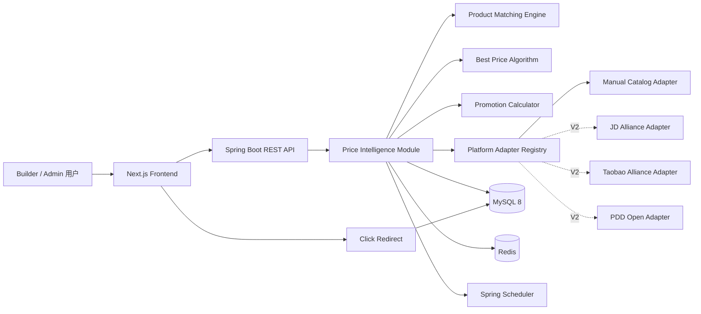
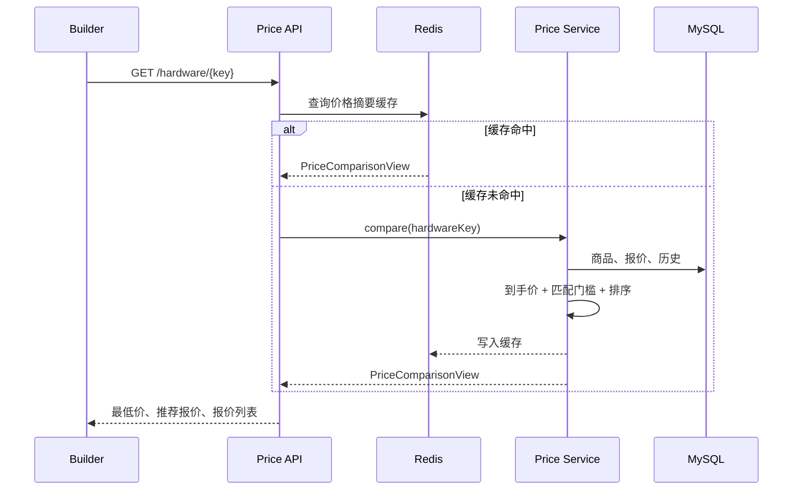
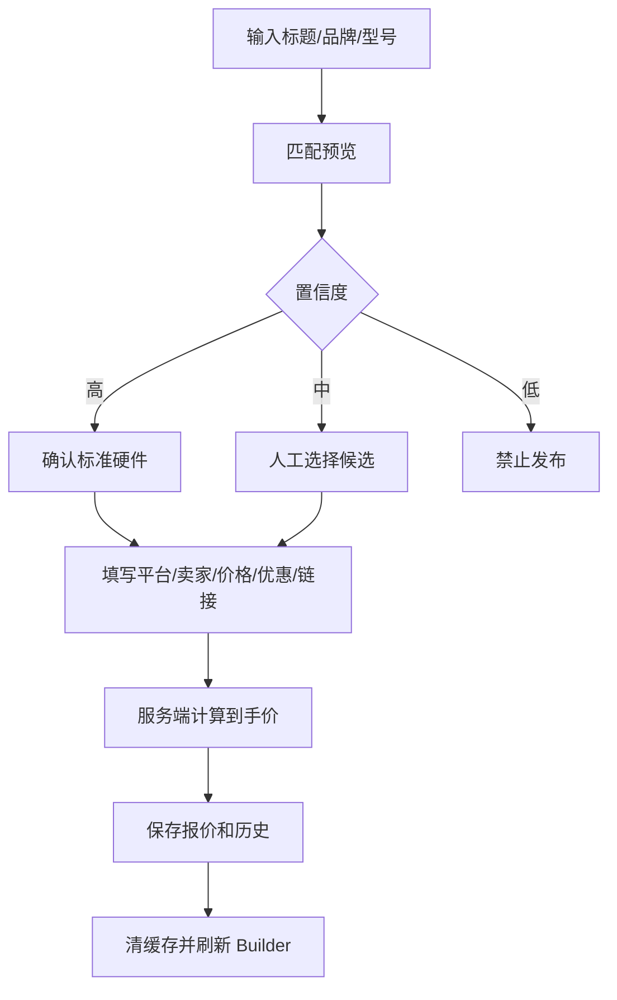

# PC LAB 3D Price Intelligence System V1.0

状态：待产品确认

日期：2026-07-31

基线：`hardware-platform-v1.0.0`

实施方向：A — 完整垂直闭环

## 1. 产品目标与范围

Price Intelligence V1.0 将当前“硬件内部目录价”升级为可解释、可维护、可追踪的商品比价中心。

用户完成装机后可以：

- 查看每个硬件的最低到手价；
- 区分最低价和综合推荐商家；
- 查看平台、卖家、优惠、运费、评分和更新时间；
- 查看 7 天或 30 天价格趋势；
- 通过受控跳转进入购买页；
- 理解为什么系统推荐某个报价。

运营人员可以：

- 在 `/admin/prices` 人工新增和编辑商品；
- 维护京东、淘宝、拼多多等平台报价；
- 预览商品与标准硬件的匹配度；
- 维护优惠、库存、商家信誉和联盟链接；
- 查看点击、热门硬件和过期报价。

### 1.1 V1.0 明确包含

- 自有商品库；
- 人工维护报价；
- 商品标准化与匹配评分；
- 到手价计算；
- 最低价与可靠商家排序；
- 价格历史；
- Redis 缓存；
- Builder 比价面板；
- Admin Price Management 页面；
- 搜索与购买点击事件；
- 可插拔平台适配接口。

### 1.2 V1.0 明确不包含

- 淘宝联盟、京东联盟、拼多多开放平台的真实调用；
- 网页爬虫、浏览器采集或绕过平台限制；
- 下单、支付、订单同步；
- 用户账户、社区和 AI 助手；
- 虚构销量、虚构评分或模拟成真实平台数据。

V1.0 的所有平台报价均标记为 `MANUAL` 数据来源。联盟 API 只保留接口边界和配置项。

## 2. 关键设计决策

### 2.1 模块化单体，而不是拆微服务

Price Service 作为 Spring Boot 应用内的独立领域模块交付：

```text
com.pclab.hardware.price
├── adapter
├── algorithm
├── controller
├── domain
├── dto
├── entity
├── mapper
├── scheduler
├── service
└── vo
```

理由：

- 当前硬件、配置和价格共享一个 MySQL 数据库；
- 独立部署会增加认证、事务、缓存和运维成本；
- `PlatformAdapter` 已提供未来拆分边界；
- 当价格同步量或平台限流要求明显增长时，可以原样提取为独立服务。

### 2.2 保留现有数据，升级现有 `product_price`

现有 `product_price` 是 `hardware_id + source + seller` 的内部目录价。V3 数据库迁移将：

1. 创建 `product`；
2. 为每条现有价格生成一个 `INTERNAL` 商品；
3. 为 `product_price` 补充 `product_id` 和优惠、信誉、销量等字段；
4. 将旧数据回填为新报价；
5. 将应用查询切换到 `product → hardware` 关系；
6. 保留原价格和更新时间，不丢弃已有数据。

迁移完成后，`product_price` 表示“某商品在某平台/卖家的当前报价”，`price_history` 保存历史快照。

### 2.3 最低价和最佳推荐分离

- `lowestOffer`：所有可购买、匹配合格、未过期报价中的最低到手价；
- `recommendedOffer`：价格、销量、评价和店铺信誉综合评分最高的报价。

系统不得用“推荐”冒充“最低价”。当推荐报价不是最低价时，必须展示价差和可靠性原因。

### 2.4 购买链接由服务端受控跳转

前端不直接信任数据库中的外链。用户点击购买时访问：

```http
GET /api/price-intelligence/offers/{offerId}/go
```

服务端校验报价、链接协议、平台域名和库存，写入点击事件后返回 `302`。这样可以避免开放重定向，并确保点击记录与实际跳转一致。

## 3. 整体架构



### 3.1 运行时数据流



## 4. 数据库设计

所有时间使用 UTC `DATETIME(3)`；金额使用 `DECIMAL(12,2)`；业务表使用 InnoDB、`utf8mb4`。

### 4.1 `product`

平台商品与标准硬件之间的匹配实体。

| 字段 | 类型 | 说明 | 索引 |
|---|---|---|---|
| id | BIGINT UNSIGNED | 主键 | PK |
| product_key | VARCHAR(100) | 稳定业务键 | UNIQUE |
| hardware_id | BIGINT UNSIGNED | 标准硬件 | INDEX, FK |
| external_sku | VARCHAR(120) NULL | 平台商品 ID | INDEX |
| title | VARCHAR(300) | 原始商品标题 | FULLTEXT |
| normalized_title | VARCHAR(400) | 标准化标题 | INDEX 前缀 |
| brand | VARCHAR(80) | 品牌 | INDEX |
| model | VARCHAR(140) | 标准型号 | INDEX |
| category | VARCHAR(40) | 分类 | INDEX |
| image_url | VARCHAR(500) | 商品图 | — |
| description | TEXT | 描述 | — |
| specification_json | JSON | VRAM、容量、OC 等规格 | — |
| match_confidence | DECIMAL(5,4) | 当前匹配置信度 | INDEX |
| match_status | VARCHAR(20) | AUTO/REVIEWED/REJECTED | INDEX |
| record_source | VARCHAR(20) | MANUAL/ADAPTER | INDEX |
| status | VARCHAR(20) | ACTIVE/INACTIVE | INDEX |
| created_at | DATETIME(3) | 创建时间 | — |
| updated_at | DATETIME(3) | 更新时间 | INDEX |

约束：

- `hardware_id` 必须引用 ACTIVE 或可管理的标准硬件；
- `match_confidence` 范围为 0–1；
- `image_url` 只允许 HTTPS 或空值；
- V1 人工创建记录固定为 `record_source=MANUAL`。

### 4.2 `product_price`

在原表上演进为当前报价表。

| 字段 | 类型 | 说明 | 索引 |
|---|---|---|---|
| id | BIGINT UNSIGNED | 主键 | PK |
| product_id | BIGINT UNSIGNED | 商品 | INDEX, FK |
| platform | VARCHAR(32) | INTERNAL/JD/TAOBAO/PDD 等 | INDEX |
| seller | VARCHAR(120) | 卖家名称 | INDEX |
| shop_type | VARCHAR(24) | SELF_OPERATED/OFFICIAL/FLAGSHIP/MARKETPLACE | INDEX |
| sale_price | DECIMAL(12,2) | 当前售价 | INDEX |
| coupon_amount | DECIMAL(12,2) | 优惠券 | — |
| full_reduction_amount | DECIMAL(12,2) | 满减 | — |
| member_discount_amount | DECIMAL(12,2) | 会员优惠 | — |
| platform_subsidy_amount | DECIMAL(12,2) | 平台补贴 | — |
| shipping_fee | DECIMAL(12,2) | 运费 | — |
| final_price | DECIMAL(12,2) | 计算后到手价 | INDEX |
| currency | CHAR(3) | 默认 CNY | — |
| sales_count | INT UNSIGNED | 销量；人工数据必须有来源 | INDEX |
| rating | DECIMAL(3,2) | 0–5 商品评分 | INDEX |
| seller_score | DECIMAL(5,2) | 0–100 店铺信誉 | INDEX |
| stock_status | VARCHAR(20) | IN_STOCK/LOW_STOCK/OUT_OF_STOCK | INDEX |
| promotion_json | JSON | 优惠说明和叠加规则 | — |
| product_url | VARCHAR(500) | 原始商品链接 | — |
| affiliate_url | VARCHAR(700) | 联盟链接 | — |
| record_source | VARCHAR(20) | MANUAL/ADAPTER | INDEX |
| checked_at | DATETIME(3) | 报价确认时间 | INDEX |
| created_at | DATETIME(3) | 创建时间 | — |
| updated_at | DATETIME(3) | 更新时间 | INDEX |
| version | INT UNSIGNED | 乐观锁 | — |

唯一约束：`(product_id, platform, seller)`。

金额约束：

- 所有优惠字段不得为负数；
- `final_price >= 0`；
- 优惠合计不能超过 `sale_price`；
- OUT_OF_STOCK 报价不参与最低价和推荐排序。

### 4.3 `price_history`

| 字段 | 类型 | 说明 | 索引 |
|---|---|---|---|
| id | BIGINT UNSIGNED | 主键 | PK |
| product_id | BIGINT UNSIGNED | 商品 | INDEX, FK |
| product_price_id | BIGINT UNSIGNED | 报价 | INDEX, FK |
| platform | VARCHAR(32) | 平台快照 | INDEX |
| sale_price | DECIMAL(12,2) | 售价快照 | — |
| final_price | DECIMAL(12,2) | 到手价快照 | INDEX |
| promotion_snapshot | JSON | 优惠快照 | — |
| recorded_at | DATETIME(3) | 采样时间 | INDEX |

每次新增报价或到手价发生变化时写入一条。后台只修改非价格字段时不制造虚假价格节点。

### 4.4 `price_click_event`

| 字段 | 类型 | 说明 | 索引 |
|---|---|---|---|
| id | BIGINT UNSIGNED | 主键 | PK |
| event_id | CHAR(36) | 公开事件 ID | UNIQUE |
| product_price_id | BIGINT UNSIGNED | 被点击报价 | INDEX |
| hardware_id | BIGINT UNSIGNED | 硬件 | INDEX |
| build_public_id | CHAR(36) NULL | 来源配置 | INDEX |
| source_page | VARCHAR(40) | BUILDER/DETAIL/ADMIN_PREVIEW | INDEX |
| session_hash | CHAR(64) | 匿名会话散列 | INDEX |
| clicked_at | DATETIME(3) | 点击时间 | INDEX |

不存储原始 IP。会话标识使用服务端盐化 SHA-256，并设置分析保留期。

### 4.5 `price_search_event`

| 字段 | 类型 | 说明 | 索引 |
|---|---|---|---|
| id | BIGINT UNSIGNED | 主键 | PK |
| query_text | VARCHAR(240) | 原始搜索词 | — |
| normalized_query | VARCHAR(260) | 标准化搜索词 | INDEX |
| hardware_id | BIGINT UNSIGNED NULL | 命中的硬件 | INDEX |
| result_count | SMALLINT UNSIGNED | 结果数 | — |
| session_hash | CHAR(64) | 匿名会话散列 | INDEX |
| searched_at | DATETIME(3) | 搜索时间 | INDEX |

### 4.6 `product_match_audit`

记录自动匹配与人工确认，保证匹配结果可解释、可回溯。

| 字段 | 类型 | 说明 | 索引 |
|---|---|---|---|
| id | BIGINT UNSIGNED | 主键 | PK |
| product_id | BIGINT UNSIGNED | 商品 | INDEX |
| hardware_id | BIGINT UNSIGNED | 候选硬件 | INDEX |
| confidence | DECIMAL(5,4) | 总分 | INDEX |
| dimension_scores | JSON | 品牌/型号/规格/关键词得分 | — |
| decision | VARCHAR(20) | AUTO/ACCEPTED/REJECTED | INDEX |
| reviewer | VARCHAR(80) | 操作者标识 | — |
| created_at | DATETIME(3) | 时间 | INDEX |

## 5. 商品标准化与匹配引擎

### 5.1 标准化流程

1. Unicode NFKC；
2. 转大写；
3. 品牌别名归一，例如 `华硕 → ASUS`；
4. 型号连写归一，例如 `RTX 50 90 → RTX5090`；
5. 容量单位归一，例如 `24 G → 24GB`；
6. 移除“新品、电竞、爆款、顺丰”等营销噪声词；
7. 标记 OC、白色、ITX、散片、二手、配件等重要属性；
8. 提取型号、容量、接口、代际和品类 token。

### 5.2 评分组成

| 维度 | 权重 |
|---|---:|
| 精确型号 | 45% |
| 品牌 | 15% |
| 关键规格 | 25% |
| 分类 | 10% |
| 关键词重合 | 5% |

惩罚：

- 型号家族冲突：-50；
- 核心容量冲突：-20；
- “显卡支架、水冷头、空盒”等配件词：-45；
- “二手、拆机、维修”且目标为全新商品：-30；
- 分类冲突：直接拒绝。

阈值：

- `>= 0.88`：允许自动匹配；
- `0.65–0.8799`：进入人工复核；
- `< 0.65`：拒绝匹配。

示例：

```text
华硕 RTX5090 OC 32G
ASUS NVIDIA GeForce RTX 5090 32GB OC

品牌 1.00
型号 1.00
规格 1.00
分类 1.00
关键词 0.85
总置信度 0.9925
```

匹配结果必须返回各维度得分与命中/冲突 token，后台不能只显示一个黑箱百分比。

## 6. 平台适配器设计

### 6.1 统一接口

```text
PlatformAdapter
├── platform()
├── isEnabled()
├── searchProduct(PlatformSearchRequest)
├── getPrice(PlatformProductRef)
└── getDetail(PlatformProductRef)
```

所有方法返回统一领域对象：

- `PlatformProductCandidate`
- `PlatformPriceSnapshot`
- `PlatformProductDetail`
- `AdapterResult<T>`，包含成功、限流、认证失败、临时失败和永久失败。

### 6.2 V1 实现

`ManualCatalogAdapter`：

- 从 MySQL 读取人工维护商品；
- 不发起外网请求；
- 支持所有已登记平台代码；
- 返回 `recordSource=MANUAL`；
- 供公共查询、排序和 Admin 预览复用。

### 6.3 V2 扩展

后续新增 Bean 即可接入：

- `JdAllianceAdapter`
- `TaobaoAllianceAdapter`
- `PddOpenPlatformAdapter`
- `TmallAllianceAdapter`
- `AmazonAssociateAdapter`
- `SuningOpenAdapter`

Adapter Registry 按平台查找启用实现。未配置密钥的平台不会实例化，不允许用模拟报价冒充真实数据。

## 7. 优惠与到手价

```text
优惠合计 =
  couponAmount
  + fullReductionAmount
  + memberDiscountAmount
  + platformSubsidyAmount

finalPrice =
  max(0, salePrice - 优惠合计)
  + shippingFee
```

规则：

- 后台提交时服务端重新计算，前端值不可信；
- `promotion_json` 记录券门槛、会员条件和是否可叠加；
- 需要会员身份的价格必须显示“会员价”标签；
- 无法确认可叠加时，只使用已确认可叠加的优惠；
- 推荐理由同时展示原价、优惠和运费构成。

## 8. 最低价与可靠商家排序

### 8.1 参与排序的安全门槛

- 商品匹配置信度 `>= 0.80`；
- 报价有库存；
- 到手价大于 0；
- 链接通过 HTTPS 和平台域名白名单；
- 热门硬件报价不超过 2 小时，普通硬件不超过 36 小时；
- 商品未被人工拒绝。

不满足门槛的报价仍可在后台查看，但不进入公共推荐。

### 8.2 综合评分

```text
score =
  priceScore × 0.40
  + salesScore × 0.20
  + ratingScore × 0.20
  + trustScore × 0.20
```

- `priceScore = 最低到手价 / 当前到手价 × 100`；
- `salesScore` 使用 `log1p` 归一化，避免大销量完全支配结果；
- `ratingScore = rating / 5 × 100`；
- `trustScore` 综合 `seller_score` 与店铺类型。

店铺类型信誉基准：

| 类型 | 基准 |
|---|---:|
| SELF_OPERATED | 100 |
| OFFICIAL | 96 |
| FLAGSHIP | 92 |
| MARKETPLACE | 72 |

最终信誉分为店铺人工信誉与类型基准的加权结果。并列时依次比较信誉、更新时间、价格。

输出示例：

```text
推荐：京东自营
到手价：¥9,299
最低价：¥8,999
价差：¥300
原因：自营店、评分 4.9、信誉 98、报价 18 分钟前确认。
```

## 9. 价格更新与缓存

### 9.1 更新策略

V1 人工模式：

- Admin 保存报价时立即重新计算并写历史；
- 热门报价超过 2 小时标记为 STALE；
- 普通报价超过 36 小时标记为 STALE；
- Scheduler 每小时扫描热门硬件并预热缓存；
- 每天扫描普通硬件、过期报价和无历史报价；
- 不自动修改人工价格。

V2 Adapter 模式：

- 热门 GPU/CPU：每小时；
- 普通硬件：每天；
- 失败使用指数退避；
- 单个平台故障不影响其他平台和内部价。

### 9.2 Redis

| Cache | Key | TTL |
|---|---|---:|
| 价格摘要 | `price:comparison:{hardwareKey}` | 5 分钟 |
| 价格历史 | `price:history:{hardwareKey}:{range}` | 15 分钟 |
| 配置报价 | `price:build:{componentHash}` | 2 分钟 |
| 热门硬件 | `price:hot` | 10 分钟 |
| Admin 仪表盘 | `price:admin:dashboard` | 1 分钟 |

报价、商品、匹配确认写入事务提交后，清理关联硬件的摘要、历史和配置报价缓存。Redis 不可用时数据库查询继续工作。

## 10. REST API

统一返回现有 `ApiResponse<T>`，错误包含 `code`、`message` 和 Trace ID。

### 10.1 公共 API

| 方法 | 路径 | 说明 |
|---|---|---|
| GET | `/api/price-intelligence/hardware/{idOrKey}` | 价格摘要与报价列表 |
| GET | `/api/price-intelligence/hardware/{idOrKey}/history` | 7D/30D 趋势 |
| POST | `/api/price-intelligence/build/quote` | 整机最低价和推荐价 |
| GET | `/api/price-intelligence/offers/{offerId}/go` | 记录点击并 302 跳转 |
| POST | `/api/price-intelligence/search-events` | 记录匿名搜索事件 |

价格摘要返回：

```json
{
  "hardwareKey": "gpu-nvidia-rtx5090",
  "lowestPrice": 8999,
  "lowestOfferId": 12,
  "recommendedOfferId": 10,
  "recommendedReason": "自营店、信誉 98、报价 18 分钟前确认",
  "priceRange": {
    "min": 8999,
    "max": 9499
  },
  "offers": [
    {
      "id": 10,
      "platform": "JD",
      "seller": "京东自营",
      "shopType": "SELF_OPERATED",
      "salePrice": 9499,
      "discount": 200,
      "shipping": 0,
      "finalPrice": 9299,
      "rating": 4.9,
      "salesCount": 3200,
      "trustScore": 98,
      "rankingScore": 94.7,
      "matchConfidence": 0.99,
      "stale": false,
      "tags": ["自营", "满减"]
    }
  ],
  "updatedAt": "2026-07-31T08:00:00Z"
}
```

趋势接口按日期返回每日最低到手价，可选 `platform`：

```http
GET /api/price-intelligence/hardware/gpu-nvidia-rtx5090/history?range=30D
```

### 10.2 Admin API

所有请求沿用 `X-Admin-Key`。

| 方法 | 路径 | 说明 |
|---|---|---|
| GET | `/api/admin/products` | 搜索、分页和过滤 |
| POST | `/api/admin/products` | 新增人工商品 |
| PUT | `/api/admin/products/{id}` | 编辑商品 |
| DELETE | `/api/admin/products/{id}` | 软删除 |
| POST | `/api/admin/products/match-preview` | 匹配候选与解释 |
| POST | `/api/admin/products/{id}/match` | 人工确认匹配 |
| POST | `/api/admin/products/{id}/offers` | 新增平台报价 |
| PUT | `/api/admin/offers/{id}` | 编辑报价并写历史 |
| DELETE | `/api/admin/offers/{id}` | 停用报价 |
| GET | `/api/admin/price-dashboard` | 数据覆盖与点击摘要 |

Admin 新增商品不接受前端提交 `match_confidence`，该值由匹配引擎生成。

## 11. Admin Price Management

路由：`/admin/prices`

### 11.1 页面结构

Desktop：

- 顶部：返回 Builder、服务状态、Admin Key 会话状态；
- 指标区：活跃商品、有效报价、过期报价、24h 点击；
- 左侧筛选：平台、分类、状态、匹配状态；
- 主表：商品、对应硬件、平台、到手价、匹配度、更新时间；
- 右侧 Drawer：商品和报价编辑；
- 历史弹窗：7/30 天曲线和变更明细。

Mobile：

- 指标变为横向滑动；
- 筛选进入 Bottom Sheet；
- 商品表变为卡片；
- 编辑 Drawer 占满屏幕。

### 11.2 人工录入流程



Admin Key 只保存于 `sessionStorage`，关闭标签页后失效，不写入 LocalStorage 或 URL。

## 12. Builder 比价体验

### 12.1 入口

- Desktop：Build Summary 增加 `COMPARE PRICES`；
- Mobile：Component Panel 操作区增加价格图标按钮；
- 默认打开当前 GPU，允许在已选八类硬件间切换。

### 12.2 Price Comparison Panel

Desktop：920 × 680 居中玻璃面板。

- Header：硬件名、最低价、更新时间、关闭；
- 推荐区：综合推荐商家、到手价、推荐理由；
- Offer List：平台、卖家、优惠、运费、评分、信誉、到手价；
- Trend：7D/30D 切换，使用轻量 SVG 曲线；
- Footer：价格说明、联盟链接披露。

Mobile：底部全高 Sheet。

- 最低价和推荐报价固定在顶部；
- 报价卡单列；
- 图表高度 160px；
- 购买按钮最小 44px；
- 不遮挡关闭与返回操作。

### 12.3 状态

- Loading：骨架报价和图表；
- Ready：最低价、推荐价和趋势；
- Partial：部分硬件无平台报价；
- Stale：显示“价格待确认”，不写“实时最低”；
- Empty：只显示内部目录价和“暂无可购买报价”；
- Error：保留当前 Builder，不影响 3D 和保存；
- Redirect blocked：显示链接校验失败，不打开外站。

## 13. 数据分析与商业化

### 13.1 V1 指标

- 搜索词数量、命中率、零结果率；
- 硬件价格页曝光；
- 平台/卖家点击；
- Builder 配置到购买点击转化；
- 热门硬件；
- 价格更新频率和过期率。

### 13.2 商业原则

- 明示“部分链接可能产生推广佣金”；
- 排名算法不因佣金改变 V1 的四项权重；
- 推荐报价必须展示原因和与最低价的价差；
- 平台数据必须展示更新时间；
- 手工数据不得伪装为开放平台实时同步；
- 后续平台回传订单时，以独立 conversion event 关联 click event，不写入用户隐私。

## 14. 安全与错误处理

- 商品和联盟链接只允许 HTTPS；
- 每个平台配置域名白名单；
- 302 跳转只读取数据库中已审核链接，不接受 URL 参数；
- Admin DTO 使用 Bean Validation；
- 金额、销量、评分、匹配度设置上下限；
- 报价更新使用乐观锁；
- 商品、报价和历史写入使用事务；
- Adapter 失败隔离，不影响内部价；
- 公共价格接口和跳转接口沿用 Redis 限流；
- 日志记录平台、报价 ID、Trace ID，不记录 Admin Key 和完整会话标识。

## 15. 验证策略

遵循项目现有轻量验证标准：

### Backend

- Flyway V3 在全新数据库执行；
- 从 V2 数据升级时旧价格完整迁移；
- Product Matching Engine 的同义词、冲突和配件拒绝；
- Promotion Calculator 边界值；
- Best Price Algorithm 最低价与推荐价分离；
- 历史只在价格变化时新增；
- 受控跳转拒绝未知域名；
- Admin Key 和参数校验；
- Redis 不可用时数据库降级。

### Frontend

- API Schema 解析；
- 比价面板 Loading/Ready/Empty/Error；
- 7D/30D 切换；
- Builder 选中硬件变化后请求正确硬件；
- Admin 表单到手价预览；
- 购买按钮使用受控跳转地址。

### Manual QA

- 1440 × 1024 Builder；
- 390 × 844 Builder；
- `/admin/prices` Desktop/Mobile；
- 新增商品 → 确认匹配 → 新增报价 → Builder 出现报价；
- 修改价格 → 写历史 → 曲线更新；
- 点击购买 → 写 click event → 302 跳转。

## 16. 里程碑与 Git 交付

### Milestone 1：数据与领域基础

- V3 数据迁移；
- Product、Offer、History、Event 实体；
- 旧价格迁移；
- 匹配、优惠和排序算法；
- 推送功能分支。

### Milestone 2：Price Service 与 Admin API

- PlatformAdapter 和 ManualCatalogAdapter；
- 公共价格、趋势、整机报价与跳转 API；
- Admin 商品和报价 API；
- Scheduler、缓存与安全；
- 推送功能分支。

### Milestone 3：Admin Price Management

- `/admin/prices`；
- Dashboard、过滤、商品/报价 Drawer、匹配解释；
- Desktop/Mobile；
- 推送功能分支。

### Milestone 4：Builder 比价

- Price Comparison Panel；
- 7D/30D 趋势；
- 购买跳转与搜索事件；
- Builder Desktop/Mobile 联动；
- 推送功能分支。

### Milestone 5：发布

- 前后端验证；
- 真实 MySQL/Redis 冒烟；
- 浏览器视觉 QA；
- README 与运行说明；
- 合并 `main`；
- 标签 `price-intelligence-v1.0.0`。

## 17. V1.0 验收标准

- 现有内部价格在迁移后仍可查询；
- Admin 可从浏览器新增商品和至少一条平台报价；
- `RTX5090` 与不同平台标题的匹配结果包含置信度和解释；
- 最低价与综合推荐可以是不同报价，并正确展示原因；
- 优惠券、满减、会员价、平台补贴和运费生成正确到手价；
- Builder 能展示最低价、推荐商家、报价列表和 7/30 天趋势；
- 用户点击购买后写入匿名 click event，并只跳往审核域名；
- Redis 失效不导致价格接口不可用；
- 不调用真实电商 API，不运行爬虫；
- 不开发 AI 助手、用户系统或社区。
