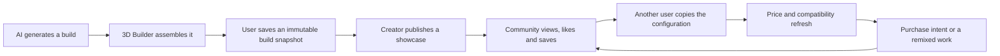
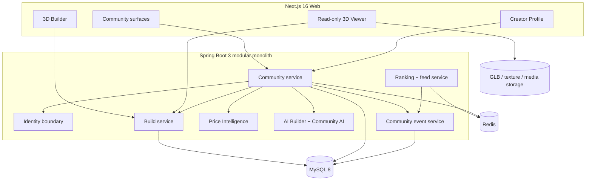
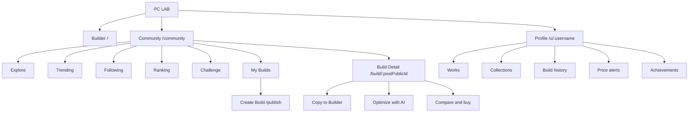
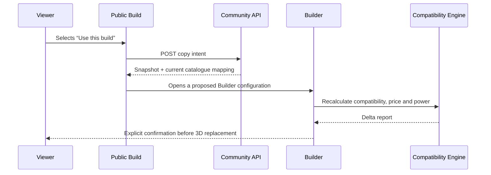

# PC LAB 3D Community & Build Ecosystem Specification V1.0

**Status:** Approved for planning
**Date:** 2026-08-01
**Product:** PC LAB 3D
**Phase:** 10 — Community + Configuration Ecosystem

## 1. Product decision

PC LAB Community is not a forum and not a merchandise feed. It is a public gallery of reproducible computer designs: every primary work has a real component snapshot, an interactive 3D machine, measured performance, a live price view and a one-click path back into Builder.

The V1 product combines three proven interaction models without copying their visual form:

- Behance: authored project narratives and presentation quality.
- Xiaohongshu: interest-driven discovery, saves and creator identity.
- Automotive enthusiast communities: reproducible specifications, modification culture and challenges.

### 1.1 North-star loop



**North-star metric:** monthly builds copied from a community work and successfully opened in Builder.
**Supporting metrics:** publish completion, 3D engagement, save rate, copy rate, price-panel open rate, challenge participation and creator return rate.

### 1.2 Scope

V1 includes:

- Explore, Trending, Following, My Builds, Ranking and Challenge surfaces.
- Build showcase publishing from an existing Builder or AI build.
- Interactive 3D cards and a full public Build Detail page.
- Likes, saves, comments, follows and configuration copies.
- Creator profiles, five-level progression and achievements.
- Deterministic rankings, personalized feed foundations and event capture.
- AI build review and explicit-confirmation optimization.
- Public read access and authenticated social writes.

V1 does not include:

- General-purpose forum threads, direct messages or group chat.
- User-to-user payments, creator payouts or paid templates.
- Installer marketplace, order fulfillment or checkout.
- Crawling marketplace data or autonomous purchasing.
- Fully independent community microservices.

## 2. Architecture decision

Three approaches were considered:

1. **Modular-monolith vertical loop — selected.** Add a bounded `community` domain to the existing Spring Boot service, reuse MySQL, Redis, Build, Price and AI contracts, and keep its API/UI isolated by feature. This provides transactional integrity and the fastest complete ecosystem loop.
2. **Frontend showcase prototype — rejected.** Visually fast, but likes, copies, ranking and creator identity would be fake and could not validate the platform loop.
3. **Dedicated social microservices — deferred.** Useful beyond sustained high traffic, but premature for V1 and would introduce distributed consistency before product-market evidence.

### 2.1 System topology



### 2.2 Boundary rules

- `build_config` remains the canonical immutable component snapshot. Publishing never rewrites it.
- `build_post` owns story, visibility, moderation and social counters; it references `build_config.public_id`.
- Live prices never alter a published snapshot. Detail pages label snapshot price and current best price separately.
- Public 3D rendering is input-driven and read-only. It must not read or mutate the global Builder or Engine stores.
- Likes, saves and follows are idempotent relationship writes protected by unique constraints.
- Counters are read-optimized projections, not independent truth. Relationship/event rows remain authoritative.
- Public browsing is anonymous. Publishing, commenting, reacting, following and challenge submission require a verified current user.
- Admin moderation remains under `/api/admin/**`; community user identity never reuses `X-Admin-Key`.

## 3. Information architecture



### 3.1 Primary routes

| Route | Purpose | Access |
|---|---|---|
| `/community` | Personalized Explore feed | Public |
| `/community/trending` | Time-window popularity | Public |
| `/community/following` | Followed creators | Signed in |
| `/community/ranking` | Performance, value and appearance boards | Public |
| `/community/challenges` | Active and archived configuration challenges | Public/read; signed in/submit |
| `/community/my-builds` | Drafts, published works and saved Builder configs | Signed in |
| `/build/[postPublicId]` | Public interactive showcase | Public |
| `/publish` | Four-step publication flow | Signed in |
| `/u/[username]` | Creator profile | Public |

## 4. Core journeys

### 4.1 Publish a computer design

| Step | User action | User psychology | Product feedback |
|---|---|---|---|
| Select | Chooses a saved Builder/AI configuration | “Use the right version” | Shows price, compatibility, last saved time and completeness |
| Generate | Requests presentation assets | “Make it look credible” | Renders poster fallback, performance report, price snapshot and AI review |
| Describe | Adds title, narrative and tags | “Express my design intent” | Live public-page preview and tag suggestions; no auto-written generic copy |
| Review | Confirms visibility and moderation | “Know exactly what becomes public” | Displays snapshot vs live-data boundary and ownership confirmation |
| Publish | Publishes work | “My machine is now shareable” | Returns public link, copy preview and creator progression gain |

Drafts autosave after each step. Failed model/poster generation does not discard text; the work remains a draft and uses a procedural fallback until assets recover.

### 4.2 Copy an expert build



Copying creates a new private build derived from the source. It never edits the author’s build. The source post records a copy event only after Builder accepts the configuration.

### 4.3 Enter a challenge

The challenge page communicates one immutable rule set: budget ceiling, eligible components, price timestamp policy, scoring weights and submission deadline. Entry validates the build at submission, freezes its score evidence and allows one active entry per user unless the challenge explicitly permits revisions.

## 5. High-fidelity experience specification

### 5.1 Community Explore

**Desktop frame:** 1440 × 1024, vertically scrollable.
**Grid:** 12 columns, 80px outer margin, 24px gutters, max content width 1280px.
**Mobile frame:** 390 × 844, 16px outer padding, 12px gaps.

Visual hierarchy:

1. 72px translucent global header with PC LAB mark, Community tabs, search and `Publish Build` action.
2. 560px Featured Lab stage: one 8-column interactive build and a 4-column editorial/challenge rail.
3. Context rail containing `FOR YOU`, applied interest chips and a transparent “Why this” explanation.
4. Three-column build grid; 408 × 440px cards with a 280px 3D stage.
5. Trending Hardware strip with GPU/CPU signals derived from community builds, not a commerce catalogue.
6. Active Challenge stage with rules, countdown and current entry distribution.

Mobile changes:

- Navigation becomes a compact title/search header and horizontally scrollable semantic tabs.
- Featured stage becomes one 358 × 520px card; editorial rail follows as a 358 × 168px module.
- Grid becomes one column.
- `Publish Build` becomes a persistent 52px bottom action only for signed-in users.
- No body-level horizontal overflow.

### 5.2 3D Build Card

The card is a miniature product stage, not an image tile.

| Region | Desktop | Content |
|---|---:|---|
| 3D viewport | 408 × 280 | Read-only machine, transparent lab stage, quality badge |
| Identity | 408 × 70 | Title, author, level, verified/official indicator |
| Specification | 408 × 48 | Primary CPU/GPU chips, snapshot price, performance |
| Social rail | 408 × 42 | Likes, saves, copies and overflow menu |

Interaction:

- Idle: camera at three-quarter front-left, 8° downward pitch, RGB fixed to author’s saved theme.
- Pointer enter: after 250ms, card becomes one of the limited live canvases and rotates at 6°/second.
- Pointer drag: up to ±32° yaw and ±10° pitch; no zoom within a feed card.
- Pointer leave: 320ms `power2.out` return to authored hero angle.
- Reduced motion: poster remains static; a dedicated `Open 3D view` control is available.
- Selected/focused: visible cyan rail and model control description; interaction is keyboard reachable.
- WebGL/model error: generated poster fallback, specification remains fully usable.

Performance rule: never mount a Canvas for every card. Maintain at most three live card canvases on desktop and one on mobile. IntersectionObserver promotes the focused/hovered card; all others use generated posters. Reuse the GLB/model cache and release GPU resources when a card leaves the live pool.

### 5.3 Build Detail

The project page follows authored narrative order:

1. **Hero Lab** — 760px desktop / 500px mobile interactive read-only 3D stage, title and three primary actions.
2. **Creator rail** — avatar, level, specialties, follow button and publication provenance.
3. **Build DNA** — eight-component list, snapshot metrics and compatibility evidence.
4. **Performance story** — gaming, production and AI scores with workload assumptions.
5. **Price intelligence** — published snapshot, current best reliable offer, delta and 7/30-day trend.
6. **Design narrative** — creator text, desk media, benchmark evidence and mod process.
7. **AI review** — rule-backed strengths, constraints and explicit optimization action.
8. **Discussion** — one-level threaded comments focused on build decisions.
9. **Related builds** — similarity plus diversity, never simple newest/random.

Primary actions:

- `USE THIS BUILD` — creates a derived private build and opens Builder confirmation.
- `OPTIMIZE MY BUDGET` — opens AI with the source configuration and a visible change proposal.
- `COMPARE CURRENT PRICE` — opens the existing price comparison experience and preserves affiliate disclosure.

### 5.4 Publish flow

Desktop uses a 320px step rail, a flexible editor and a 420px live preview. Mobile uses a single column with a sticky step title and bottom Continue action.

1. `SOURCE` — choose a complete saved build or current Builder build.
2. `GENERATE` — produce 3D poster, metrics, current-price report and AI review.
3. `STORY` — title 4–80 characters, description 20–4000, 1–5 tags, optional media.
4. `REVIEW` — preview public page, select Public/Unlisted and publish.

The workflow prevents publishing incompatible builds with `ERROR`. `WARNING` builds may publish only after the warning is acknowledged and shown publicly.

### 5.5 Profile

Profile is a creator portfolio, not an account-settings dashboard.

- Hero: identity, specialties, level, XP progress, follow state and three credibility metrics.
- Works: Published, Challenges and Remix tabs.
- Library: saved builds and collections are private by default.
- History: configuration revisions and source attribution.
- Price alerts: links into Price Intelligence.
- Achievements: earned badges with verifiable criteria, never manually claimed labels.

### 5.6 Ranking and Challenge

Ranking tabs:

- Gaming Performance — normalized gaming score, compatibility must be `SUCCESS`.
- Value — performance divided by a fixed price snapshot under an explicit budget band.
- Appearance — engagement-based with fraud controls; displayed as “Community Choice”, not objective beauty.
- Rising — velocity over seven days with creator diversity.

Each row exposes the scoring formula, data timestamp and disqualification reasons. Challenge results retain a frozen evidence record even when live prices later change.

## 6. Design system extension

Community reuses the existing dark laboratory system; it does not introduce a social-network theme.

New semantic tokens:

| Token | Purpose |
|---|---|
| `--color-community-stage` | Neutral 3D card viewport |
| `--color-community-editorial` | Featured/editorial violet surface |
| `--color-community-live` | Live/active creator state |
| `--color-community-official` | Official hardware partner identity |
| `--shadow-community-card` | Deep card separation without generic glow |
| `--size-community-header` | 72px desktop / 56px mobile |

Typography:

- Display: Space Grotesk, 56/60 featured title, 36/40 page title, 24/30 card feature.
- Body: Noto Sans SC, 14/22 core narrative, 12/18 metadata.
- Micro labels: existing 11px minimum token; never render 7–10px interface text.

Motion:

- Route reveal: 420ms, `[0.2, 0.8, 0.2, 1]`, opacity plus 12px vertical travel.
- Card promotion to live 3D: 240ms crossfade.
- Like/save feedback: 180ms scale 0.96 → 1 with no particle burst.
- Copy success: 320ms status rail followed by Builder transition.
- All decorative motion respects `prefers-reduced-motion`.

## 7. Read-only 3D architecture

The existing `PCViewer` is Builder-bound and must not be mounted directly on community pages. V1 introduces a props-driven scene boundary:

```text
ReadonlyBuildViewer
├── BuildSceneInput
│   ├── selected component IDs
│   ├── resolved model manifest
│   ├── RGB theme
│   └── authored camera preset
├── ViewerQualityPolicy
├── ReadonlyCameraController
├── SharedModelCache
└── FallbackPoster
```

Rules:

- No import from `builderStore`, `engineStore` or `BuilderEngineSync` inside the read-only viewer.
- The public viewer cannot enqueue replacements, select components or persist camera state globally.
- Detail pages allow orbit, zoom, Internal and Exploded modes.
- Feed cards allow authored orbit only; no exploded view or internal part selection.
- Poster generation records model manifest version and SHA-256 so stale previews can be regenerated.

## 8. Data model

### 8.1 Identity foundation

Existing `users` remains the account root. Add:

- `user_profile(user_id, bio, avatar_url, banner_url, specialties_json, level, xp, followers_count, following_count, works_count, created_at, updated_at)`.
- `user_session(id, user_id, token_hash, expires_at, revoked_at, created_at, last_seen_at)`.

V1 uses an opaque session token in an HttpOnly, Secure, SameSite=Lax cookie. Only the token hash is stored. State-changing requests use CSRF protection. Existing Admin key authentication remains separate.

### 8.2 Community tables

#### `build_post`

| Field | Type | Notes / index |
|---|---|---|
| `id` | BIGINT UNSIGNED | PK |
| `public_id` | CHAR(26) | ULID, unique public route |
| `author_user_id` | BIGINT UNSIGNED | FK users; index with status/time |
| `build_public_id` | CHAR(36) | FK build_config.public_id; immutable source |
| `post_type` | VARCHAR(24) | BUILD_SHOWCASE, DESK_SETUP, BENCHMARK, MOD_LOG |
| `title` | VARCHAR(80) | Search index candidate |
| `description` | TEXT | Sanitized rich text subset |
| `visibility` | VARCHAR(16) | PUBLIC, UNLISTED |
| `status` | VARCHAR(24) | DRAFT, GENERATING, REVIEW, PUBLISHED, ARCHIVED |
| `rgb_theme_json` | JSON | Authored presentation state |
| `camera_preset_json` | JSON | Validated camera bounds |
| `poster_url` | VARCHAR(500) | Fallback/OG media only |
| `build_snapshot_hash` | CHAR(64) | Provenance integrity |
| `published_at` | DATETIME(3) | Feed ordering |
| counts | BIGINT UNSIGNED | view, like, save, comment, copy projections |
| `version` | INT UNSIGNED | Optimistic concurrency |
| timestamps | DATETIME(3) | UTC |

#### Relationship and narrative tables

- `build_post_tag(post_id, tag_code)` unique `(post_id, tag_code)`.
- `build_post_media(id, post_id, media_type, url, width, height, sort_order, checksum_sha256)`.
- `build_post_like(id, user_id, post_id, created_at)` unique `(user_id, post_id)`.
- `build_post_save(id, user_id, post_id, collection_key, created_at)` unique `(user_id, post_id)`.
- `build_comment(id, public_id, user_id, post_id, parent_id, content, status, like_count, created_at, updated_at)`; V1 nesting depth is one.
- `user_follow(id, follower_user_id, followed_user_id, created_at)` unique pair and no self-follow.
- `build_derivation(id, source_post_id, derived_build_public_id, user_id, mode, created_at)` for COPY or AI_OPTIMIZE attribution.

### 8.3 Challenge, progression and AI

- `community_challenge(id, public_id, title, rules_json, scoring_json, starts_at, ends_at, status, created_by, timestamps)`.
- `community_challenge_entry(id, challenge_id, user_id, post_id, evidence_json, score, rank, status, submitted_at)` unique active user/challenge entry.
- `achievement_definition(code, name, description, icon_url, xp_reward, criteria_json, status)`.
- `user_achievement(id, user_id, achievement_code, evidence_json, awarded_at)` unique user/achievement/evidence key.
- `user_xp_ledger(id, user_id, source_type, source_id, delta, reason_code, created_at)`; XP is ledger-derived.
- `build_ai_review(id, post_id, build_snapshot_hash, verdict_json, prompt_version, route, created_at)`.
- `community_moderation_log(id, subject_type, subject_id, rule_codes_json, route, decision, reviewer_user_id, created_at)`.
- `community_event(id, event_id, actor_user_id, session_hash, event_type, post_id, metadata_json, occurred_at)` partition/archive candidate.

## 9. API contract

### 9.1 Public reads

- `GET /api/community/feed?mode=EXPLORE&cursor=...&limit=18`
- `GET /api/community/posts/{publicId}`
- `GET /api/community/posts/{publicId}/comments?cursor=...`
- `GET /api/community/rankings?category=GAMING&period=MONTH`
- `GET /api/community/challenges?status=ACTIVE`
- `GET /api/community/challenges/{publicId}`
- `GET /api/community/users/{username}`

Feed pagination is cursor-based using score/time/public ID, never offset-based for personalized or changing feeds.

### 9.2 Authenticated writes

- `POST /api/community/posts/drafts`
- `PATCH /api/community/posts/{publicId}/draft`
- `POST /api/community/posts/{publicId}/generate`
- `POST /api/community/posts/{publicId}/publish`
- `PUT|DELETE /api/community/posts/{publicId}/like`
- `PUT|DELETE /api/community/posts/{publicId}/save`
- `POST /api/community/posts/{publicId}/comments`
- `PATCH|DELETE /api/community/comments/{commentPublicId}`
- `PUT|DELETE /api/community/users/{username}/follow`
- `POST /api/community/posts/{publicId}/copy`
- `POST /api/community/posts/{publicId}/ai-optimize`
- `POST /api/community/challenges/{publicId}/entries`

All write DTOs reject client-supplied `user_id`, counters, rank, AI verdict or moderation status. The server derives actor identity and authoritative metrics.

### 9.3 Response principles

- Return `viewerManifest`, resolved component summaries and authored camera/RGB state for public 3D.
- Return `viewerState` (`liked`, `saved`, `following`) only when authenticated; otherwise false/null without failing the public request.
- Return snapshot and live pricing as two explicitly named structures.
- Use stable error codes: `AUTH_REQUIRED`, `BUILD_NOT_OWNED`, `BUILD_INCOMPLETE`, `BUILD_INCOMPATIBLE`, `MODERATION_REVIEW`, `VERSION_CONFLICT`, `CHALLENGE_CLOSED`, `RATE_LIMITED`.

## 10. Feed and ranking algorithms

### 10.1 Explore score

Candidate generation draws from interest tags, followed creators, similar hardware, trending, challenge/editorial and 15% exploration inventory.

```text
score = 0.35 affinity
      + 0.20 freshness
      + 0.20 trusted engagement
      + 0.15 copy conversion
      + 0.10 build quality
      - fatigue penalty
      - integrity penalty
```

Affinity comes from viewed hardware/tags, dwell, internal/exploded 3D actions, saves, copies and searches. A like is weaker than a save; a confirmed copy is strongest. Sensitive personal attributes are not inferred.

Cold start uses selected interests plus a diversified editorial/trending pool. Every 12-card window caps one creator at two works and one hardware family at four works.

### 10.2 Trending score

```text
engagement = 3*unique_likes + 4*saves + 6*confirmed_copies
           + 2*meaningful_comments + 0.15*qualified_views
trending = log10(1 + engagement) * exp(-age_hours / 72)
```

Events from duplicate sessions, suspicious velocity, self-interaction or deleted/review content receive zero or reduced weight. Redis sorted sets serve hour/day/week candidates; MySQL event rows remain authoritative and rebuildable.

### 10.3 Levels

| Level | Name | Minimum XP | Meaning |
|---|---|---:|---|
| 1 | New Builder | 0 | Can publish and participate |
| 2 | Hardware Player | 500 | Consistent complete builds |
| 3 | Advanced Builder | 2,000 | Helpful, reproducible works |
| 4 | Mod Master | 7,500 | Recognized mod/challenge work |
| 5 | PC Architect | 20,000 | Sustained high-quality contribution |

XP events are capped and reversible: publish +100, first 100 qualified views +25, qualified save +2, confirmed copy +10, accepted challenge entry +50, placement bonus. Likes alone do not create unbounded XP.

## 11. AI community capability

### 11.1 AI Review

On generation/publish, deterministic compatibility, headroom, price and performance rules produce the factual analysis. An optional LLM converts those facts into concise explanation only; it cannot change the verdict or invent components.

Review output contains:

- strengths with evidence codes;
- constraints and severity;
- upgrade value or downgrade opportunity;
- price timestamp and workload assumptions;
- `build_snapshot_hash` and prompt/rule versions.

### 11.2 AI Optimize

`OPTIMIZE THIS BUILD` sends the source component IDs, budget target, preservation locks and intent to the existing AI Builder boundary. It returns a proposal and delta. The user must confirm before a derived build is saved or sent to the 3D replacement queue.

### 11.3 Content safety

- Rule-based filters handle links, credential leakage, prohibited text and spam first.
- A separate `CONTENT_MODERATION_V1` prompt may return only `PASS`, `REVIEW_REQUIRED` or `REJECT` plus reason codes.
- Post text is untrusted context and cannot override system instructions.
- Raw private drafts are not used for training or stored in AI request logs.

## 12. Caching, events and consistency

Redis keys:

- `community:post:{publicId}:v{version}` — public detail, 10 minutes.
- `community:feed:trending:{period}:{segment}` — sorted set, continuously refreshed.
- `community:ranking:{category}:{period}` — sorted set, five-minute publish.
- `community:profile:{username}` — five minutes.
- `community:reaction:{userId}:{postId}` — short-lived viewer state.

Mutation transaction rules:

- Insert/delete relationship and counter projection update occur in one database transaction.
- Cache invalidation happens after commit.
- Publish writes post state, tags and moderation decision atomically.
- Expensive poster, AI review and feed aggregation use jobs with idempotency keys.
- Every job can be retried safely and surfaces `GENERATING`/`FAILED` state to the UI.

## 13. Security, privacy and abuse controls

- Opaque HttpOnly sessions, BCrypt password hashes, CSRF protection and per-action rate limits.
- Ownership checks on build source, draft edits, comment edits and media deletion.
- Server-side HTML sanitization with a minimal formatting allowlist.
- Signed media upload intent, MIME/size validation, malware scan hook and SHA-256 provenance.
- Public APIs never expose email, password hash, session IDs, IP or raw audit metadata.
- View events store a rotating session hash; logged-in analytics uses pseudonymous user ID.
- Like/save/follow endpoints are idempotent and reject self-follow.
- Moderation actions are append-only audited; soft deletion preserves evidence.
- Affiliate links retain platform disclosure and reuse Price Intelligence redirect logging.

## 14. Commercial surfaces

Commerce remains contextual:

- Price comparison appears after the build story and on explicit action, never as a product grid.
- Confirmed community copies retain source attribution for conversion analysis.
- Official hardware partners receive a labeled identity and cannot purchase ranking placement.
- Sponsored challenges are labeled and use the same published scoring rules.
- Certified installers and paid templates remain post-V1; no UI promises them before supply, dispute and payment systems exist.

## 15. Observability and analytics

Required events:

- feed impression, qualified view, 3D activation, orbit/internal/exploded action;
- like, save, comment, follow;
- publish step start/complete/failure;
- copy intent, copy accepted, AI optimize accepted;
- price panel open, offer click;
- challenge view, entry, validation failure;
- moderation and job outcomes.

Dashboards separate engagement from ecosystem value: impressions are never compared directly with confirmed copies or purchase clicks.

## 16. Accessibility and responsive acceptance

- All interactive controls have a 44 × 44px minimum target on touch layouts.
- 3D cards expose title, components, performance and action semantics without Canvas.
- Keyboard users can focus, activate and exit every 3D stage without a pointer trap.
- Focus is visible against glass surfaces; dialog focus is contained and restored.
- Status changes use polite live regions; errors use actionable text.
- Content remains usable with WebGL off, reduced motion on and 200% text zoom.
- Community pages use scoped scrolling; the Builder’s current `body { overflow: hidden; }` must not block long-form routes.

## 17. Release acceptance criteria

The ecosystem V1 is accepted when:

1. A signed-in user can publish a complete saved build through four resumable steps.
2. The public link renders a read-only 3D computer, complete specifications and snapshot/live price separation.
3. A visitor can copy the build; Builder recalculates compatibility, price, power and performance before confirmation.
4. Like, save, comment and follow writes are authenticated, idempotent and correctly reflected in counters.
5. Explore, Trending and Ranking are deterministic, cursor-paginated and rebuildable from events.
6. A challenge entry is validated and retains immutable scoring evidence.
7. AI review cites deterministic facts; AI optimization never mutates a build without confirmation.
8. Desktop and mobile surfaces pass the defined accessibility, no-overflow and reduced-motion scenarios.
9. No Community module imports mutable Builder/Engine stores except the explicit “apply copied build” transition.
10. Existing Builder, Price Intelligence and AI Builder test suites remain green.

## 18. Delivery sequence

| Sprint | Goal | Shippable result |
|---|---|---|
| 1 | Identity + community foundation | Session boundary, drafts/publish, Explore read, likes and saves |
| 2 | Public 3D showcase | Read-only viewer, 3D card pool, Build Detail, poster fallback, copy-to-Builder |
| 3 | Social graph | Comments, follows, Profile, collections, event integrity controls |
| 4 | Ranking + challenges | Trending, monthly/category rankings, challenge submission and progression ledger |
| 5 | AI community capability | Evidence-backed review, explicit optimization, moderation pipeline and Admin operations |

Each Sprint ends with a tagged, independently deployable vertical slice. Community work begins on `codex/community-ecosystem-v1`; completed AI Builder V1 remains frozen at `ai-builder-v1.0.0`.
