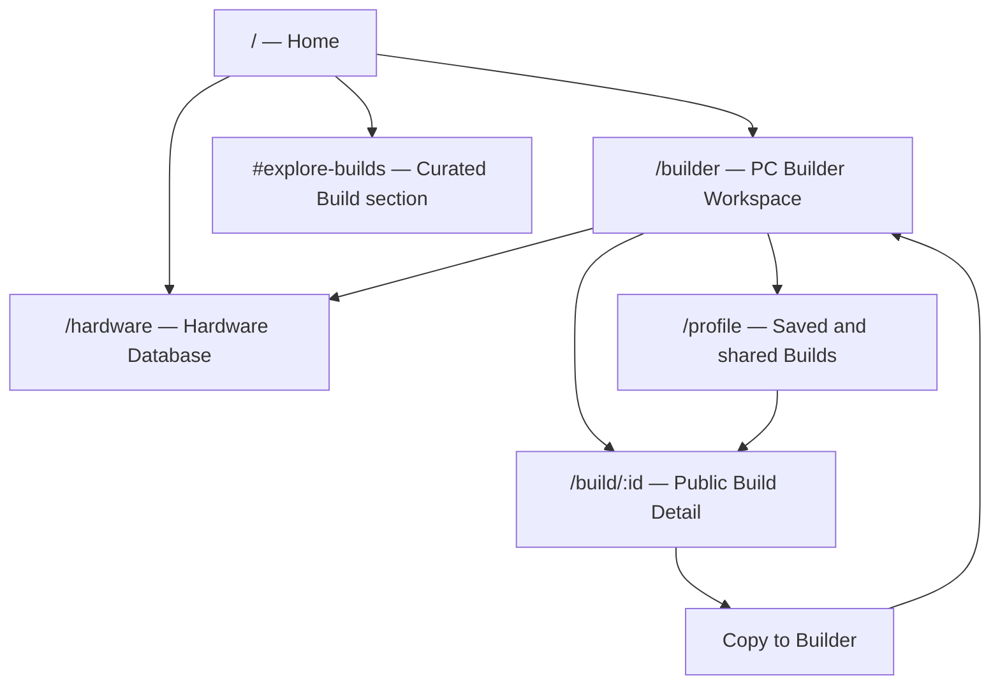
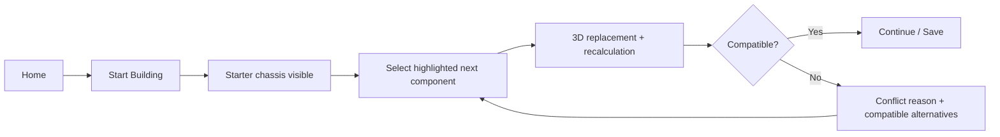

# PC LAB 3D V3.0 Design Specification

**Status:** Design review candidate — implementation is not authorized by this document
**Date:** 2026-08-01
**Product:** PC LAB 3D
**Phase:** V3.0 Product and Frontend UI/UX Redesign
**Primary frame:** Desktop 1440 × 1024
**Responsive frames:** Tablet 1024 × 768; Mobile 390 × 844

---

## 1. Executive decision

PC LAB 3D V3.0 is a professional 3D PC design workstation. It is not a cinematic technology landing page, a marketplace catalogue, a forum, or a chatbot with a configurator attached.

The redesign moves the product hierarchy from:

```text
Brand spectacle → 3D demo → feature panels → Builder
```

to:

```text
Start build → choose component → inspect physical result → verify compatibility/price → save/share
```

The computer and the configuration task are the product. UI chrome exists only to help users select, understand, compare, validate, and preserve a build.

### 1.1 Problems being corrected

1. The current visual language is too close to an Awwwards technology showcase: cyan HUD labels, large atmospheric framing, glass layers, and brand telemetry compete with the task.
2. Builder capabilities exist, but the workflow hierarchy is weak. Category, selected part, compatibility, 3D state, price, and next action all demand attention at once.
3. The product has invested in AI and Community surfaces before the saved-Build and share loop is mature.
4. The public route currently opens the engine directly, so there is no clear distinction between a lightweight entry point and the professional workspace.
5. The interface is dense without being a true tool: panels float over the stage, while expert users need predictable, stable work regions.

### 1.2 Direction alternatives

| Direction | Description | Decision |
|---|---|---|
| A. Tool-first workstation | Minimal launch page, fixed Builder panels, persistent summary, purposeful 3D modes | **Selected** |
| B. Refined cinematic site | Keep a branded scroll narrative, reduce particles, polish the existing visual language | Rejected: still makes marketing the product |
| C. Ecosystem-first platform | Lead with community feed, AI assistant, rankings and templates | Deferred: lacks sufficient Build supply and weakens the primary task |

The selected direction keeps the engineering investment in 3D, compatibility, price and build persistence, while replacing the presentation and navigation layer.

## 2. Product definition

### 2.1 Positioning

**Name:** PC LAB 3D

**Category:** Professional 3D PC design workstation

**Promise:** Configure a physically valid computer, understand its performance and cost, and inspect the result in 3D without leaving one workspace.

**Primary audience:**

- PC enthusiasts who know components and want a faster, more visual workflow.
- First-time builders who need compatibility guidance without being forced through a wizard.
- Creators, gamers and AI developers comparing complete system trade-offs.

**Not the product:**

- A product grid optimized for seller conversion.
- A forum or social feed.
- A general-purpose AI conversation interface.
- A long-form brand story.

### 2.2 V3 principles

1. **Builder before brand.** The primary CTA reaches `/builder` in one action.
2. **The model is the canvas.** Side panels are stable and visually quieter than the PC.
3. **State is always visible.** Selected part, total, performance and compatibility never disappear behind navigation.
4. **Expert speed, beginner clarity.** Visible labels, shortcuts and progressive detail serve both groups.
5. **Explain conflicts at the point of choice.** Never wait until checkout or save.
6. **AI is an action, not a persona.** `Optimize Build` produces a reviewable delta.
7. **Share precedes social.** A public Build is the only V3 content object.
8. **Motion explains change.** No animation exists only to signal “future technology.”

### 2.3 Product success measures

| Metric | V3 target |
|---|---:|
| Home → Builder start | One click; primary CTA visible immediately |
| New user understands the product | Within 5 seconds without scrolling |
| First component selection | Within 20 seconds for a fresh user |
| Compatibility status visibility | Always visible after first selection |
| Save/share completion | At most two explicit confirmation steps |
| Builder layout shift during selection | Zero structural movement |
| Desktop workspace content hidden behind overlays | Zero critical controls |

## 3. Delete, defer, retain and redesign matrix

“Delete” below means remove from the V3 product surface and active roadmap. It does not authorize deleting working domain services or historical design documents.

### 3.1 Remove from the primary product

| Current/previous direction | V3 action | Engineering boundary |
|---|---|---|
| Huge Hero typography and long scroll narrative | Do not build; replace with one compact launch Hero | No cinematic landing dependency |
| Decorative particles, data streams and HUD corner ornaments | Remove from Home and Builder | Keep purposeful airflow particles only |
| Multi-layer cyan/violet glass aesthetic | Deprecate as the default UI language | Existing styles remain until their V3 surface is replaced |
| Persistent floating AI chat launcher | Remove from Builder | Keep AI backend and proposal logic |
| Chat transcript/composer as the primary AI UX | Remove from V3 user flow | Replace later with `Optimize Build` dialog |
| Community Feed, comments, follows, rankings and challenges | Keep out of V3 runtime | Preserve Phase 10 documents as deferred research |
| “Future lab” promotional copy | Remove | Replace with concise task language |

### 3.2 Retain as working capability

| Capability | Retention rule |
|---|---|
| Three.js model hierarchy, viewer, Orbit controls and replacement queue | Reuse; reframe inside the V3 Workspace |
| Builder Store and selected-component state | Reuse unchanged unless a UI contract requires a typed adapter |
| Hardware API/database and specification models | Reuse as the source of the Component Library and Hardware route |
| Compatibility, performance and power calculations | Reuse as authoritative rules; redesign only presentation |
| Price comparison, history and tracked outbound links | Reuse; expose from summary/contextual panel rather than dominating selection |
| Build save and public identifier | Strengthen into the V3 Build/share object |
| Admin Price and Admin AI operations | Keep as internal routes; exclude from public navigation |
| AI solver and budget-shortfall output | Keep dormant until the Optimize Build action is restored |

### 3.3 Redesign now

- Root navigation and route responsibilities.
- Minimal Home launch page.
- Builder Workspace shell and all user-facing Builder components.
- Public Build Detail presentation.
- Hardware Explorer as a technical database, not a shop.
- Profile as a saved/shared Build workspace, not a social profile.
- Tokens, typography, density, panels, states and motion.

### 3.4 Deferred explicitly

- Community discovery feed and recommendation ranking.
- Comments, follows, reactions, creator levels and challenges.
- AI chat, conversational history and floating assistant.
- Creator monetization, installer services and template sales.
- Live marketplace crawling or checkout.

## 4. Information architecture



### 4.1 Route responsibilities

| Route | Primary job | Primary action | V3 status |
|---|---|---|---|
| `/` | Explain product in 5 seconds and start a build | `Start Building` | Redesign |
| `/builder` | Configure and inspect a PC | Select hardware | Highest priority |
| `/build/[id]` | Present one reproducible public Build | `Copy Build` | Restore after Builder |
| `/hardware` | Search and compare technical hardware records | `Add to Build` / `Compare` | Secondary tool |
| `/profile` | Manage private, saved and shared Builds | `Open Build` | Lightweight user center |

`Explore` in the Home header scrolls to `/#explore-builds`. It is not a Feed route in V3. This resolves the apparent conflict between the desired Home navigation and the delayed Community system.

Authentication is a utility flow opened by `Login`; it is not a top-level product area. Internal `/admin/prices` and `/admin/ai` routes remain outside this sitemap.

### 4.2 Global navigation rules

- Home uses a 72px public header with `Build`, `Hardware`, `Explore`, `Login`, and `Start Building`.
- Builder replaces public navigation with a 64px task toolbar. It does not show marketing links in the center of the work session.
- Build Detail uses a 64px compact public header with `Open in Builder`.
- Hardware and Profile use a 64px application header and a maximum 1280px content width.
- The PC LAB mark always returns Home; unsaved Builder changes trigger a named confirmation.

## 5. Core journeys

### 5.1 New user: first valid build



The interface recommends an order but never locks experts into a wizard. Empty slots display `Select` and the next recommended slot receives one quiet blue indicator.

### 5.2 Expert: revise an existing build

Open saved Build → choose a category → filter/search hardware → inspect price/performance delta → select → view installation → save new version. The previous Build remains recoverable until the new version is saved.

### 5.3 Share and copy

Save Build → Share → choose public title/visibility → receive `/build/[id]` → viewer inspects 3D/specifications/current pricing → `Copy Build` → current compatibility and price are recalculated → user confirms substitutions → Builder opens the copied version.

## 6. Figma file and responsive foundation

### 6.1 Figma pages

1. `00_Cover & Decisions`
2. `01_Foundations`
3. `02_Components`
4. `03_Home`
5. `04_Builder Workspace`
6. `05_Build Detail`
7. `06_Hardware`
8. `07_Profile`
9. `08_Responsive`
10. `09_Prototype & Motion`
11. `10_Archive V2`

### 6.2 Frame set

| Frame | Size | Grid |
|---|---:|---|
| Desktop reference | 1440 × 1024 | 12 columns; 80px margin; 24px gutter for content pages |
| Builder desktop | 1440 × 1024 | Fixed 32px outer inset; 280 / 720 / 360 columns; 8px gaps |
| Compact desktop | 1280 × 800 | 16px outer inset; 248 / 664 / 320 columns; 8px gaps |
| Tablet | 1024 × 768 | 8 columns; 32px margin; 20px gutter |
| Mobile | 390 × 844 | 4 columns; 16px margin; 12px gutter |

### 6.3 Breakpoints

- `≥ 1280`: persistent three-column Builder.
- `1024–1279`: compact persistent Builder panels.
- `768–1023`: canvas first; Component Library and Build Panel become docked side sheets.
- `< 768`: 56px toolbar, 42–46dvh Viewer, horizontal component slots, bottom-sheet options and summary.

No breakpoint may introduce body-level horizontal scrolling. Panel content may scroll only inside an explicitly labelled region.

## 7. Home — high-fidelity specification

### 7.1 Goal

The first viewport answers three questions without scrolling:

1. What is this? A 3D PC builder.
2. What can I do? Configure a complete computer.
3. Where do I start? `Start Building`.

### 7.2 Desktop composition — 1440 × 1024

#### Header

- Position: top, sticky only after the first scroll threshold.
- Size: 1440 × 72px; content width 1280px; 80px side margins.
- Surface: `rgba(17,17,17,0.82)`, 16px backdrop blur, one bottom `#252525` border. No glow.
- Left: PC LAB wordmark, 124 × 32px.
- Center: `Build`, `Hardware`, `Explore`; 14px/500; 24px gaps.
- Right: `Login` text action and 148 × 44px `Start Building` button.
- Hover: text changes to primary text over 140ms; active route uses a 2px blue underline, not a pill.

#### Hero

- Height: 760px below the header. The next section begins at y=832 so the first viewport shows its opening edge.
- Content: 1280px wide, 12-column grid.
- Copy block: columns 1–5, vertically centered, maximum width 440px.
- Eyebrow: `PROFESSIONAL 3D PC BUILDER`, 12px/600, muted gray, no animated telemetry.
- H1: `Build Your Dream PC`, 48px/600, 52px line height, maximum two lines.
- Supporting copy line 1: `Design your perfect computer.`, 18px/500.
- Supporting copy line 2: `Choose every component, verify compatibility, and inspect the finished machine in real time.`, 15px/400, 24px line height, maximum two lines.
- CTA: 156 × 48px, 16px/600, blue action surface; placed 28px below copy.
- Secondary proof row: `8 component classes · live compatibility · 3D assembly`, 12px/500, 20px gap; no icon animation.
- 3D model stage: columns 6–12, bounding box approximately 760 × 680px, center at x≈955 / y≈430.
- Camera: front-left three-quarter view, yaw −28° to −34°, pitch 8° to 12°, 35–40mm equivalent perspective. The front glass and internal GPU must be readable simultaneously.
- Lighting: neutral 5000K top-left softbox, restrained blue rear rim, low-intensity front fill and soft floor contact shadow. RGB is off or one quiet static white/blue state.
- Background: `#080808` with a 64px grid at 3–4% opacity and one broad radial lift behind the model. No particle field, data streams or HUD brackets.

**First-second perception:** the user sees the full PC silhouette and blue CTA first, then reads the concise promise. The brand is present but never larger than the task.

#### Hero interaction

- Model follows pointer by at most 2° yaw/pitch; disabled for reduced motion and touch.
- Dragging the Hero model is optional and visually labelled `Drag to inspect`; it never blocks the CTA.
- CTA pressed feedback is 100–140ms; route transition uses a 160ms opacity handoff.
- Loading shows a stable poster generated from the same camera preset. No blank Canvas.

### 7.3 Explore Builds section

- Anchor: `#explore-builds`.
- Section width: 1280px; 80px side margins; 96px top and bottom padding.
- Header: `Explore Builds`, 32px/600; one-line description; `View all` is absent until a real collection route exists.
- Grid: three 410 × 420px cards, 24px gaps.
- Preview stage: 410 × 264px, dark neutral surface, real poster by default.
- Hover/focus: at most one card activates a low-quality read-only 3D preview and rotates 12° over 6 seconds; pointer leaving restores poster.
- Card content: Build name, CPU + GPU, total price, performance score, author/source; no likes or follower counts.
- Card CTA: whole-card `View Build`; secondary `Copy` appears on focus/hover but remains keyboard reachable.

### 7.4 Mobile — 390 × 844

- Header: 56px, 16px inset; logo, `Build` CTA and menu. Public links live in a labelled sheet.
- Hero: 700px minimum; copy first, model second.
- H1: 36px/600; CTA 100% × 48px.
- Model box: 358 × 360px, camera pulled back so the entire chassis remains visible.
- Proof row wraps to two lines; no tiny horizontal ticker.
- Explore cards become a one-column 358 × 390px list.

## 8. Builder Workspace — high-fidelity specification

### 8.1 Goal

The Builder is the product's default working environment. It must feel closer to Figma's stable canvas and a vehicle configurator's persistent summary than to a floating dashboard.

### 8.2 Desktop shell — 1440 × 1024

- Top Toolbar: 1440 × 64px.
- Workspace region: y=64 to 1024.
- Grid: 1376px centered with 32px outer insets and two 8px gaps.
- Columns: Component Library 280px / 3D Workspace 720px / Build Panel 360px.
- Panel top/bottom inset: 8px; working height 944px.
- Panels use opaque tonal surfaces and 1px borders. Glass is reserved for controls floating directly over the 3D stage.

### 8.3 Toolbar — 64px

| Region | Width/position | Content |
|---|---|---|
| Brand | left 184px | PC LAB mark; returns Home |
| Build identity | center-left, flexible | Editable `My Gaming Beast`; saved/unsaved status |
| Build health | center-right | `Budget ¥13,000`, `Performance 95`, compact compatibility state |
| Actions | right | Save, Share, overflow; 40–44px targets |

- Surface: `#111111`; lower border `#252525`.
- Build name enters inline edit on click/Enter and commits on Enter/blur; Escape cancels.
- Budget opens a compact popover, not a modal.
- Save is primary only when dirty. Share is disabled with a visible reason until the Build has been saved.
- No animated engine version, connection telemetry, slogan or decorative status LED.

### 8.4 Left: Component Library — 280px

#### Structure

1. Panel title row: `COMPONENTS`, completion `6/8`, collapse action.
2. Search/filter field: 240 × 36px.
3. Eight `ComponentSlotRow` items: CPU, GPU, Motherboard, Memory, Storage, Cooling, Power, Case.
4. Active category divider and `OPTIONS` header with result count/sort.
5. Hardware option list with internal scroll.

`ComponentSlotRow` is 240 × 40px. It displays icon, category, current part or `Select`, and a status mark. Required-next receives a 2px blue left edge; it never pulses.

#### Hardware option card — 240 × 72px

| Position | Content |
|---|---|
| x=12, y=12 | 40 × 48px hardware thumbnail or technical silhouette |
| x=64, y=10 | Brand label, 11px/500 |
| x=64, y=27 | Model name, 14px/600, one-line ellipsis |
| x=64, y=49 | Performance level and relevant specification |
| right 12 | Price/delta or installed check |

The metadata changes by category: CPU shows core/socket/TDP, GPU shows VRAM/length/power, RAM shows capacity/generation/frequency, PSU shows wattage/certification.

#### Card states

- **Default:** `#161616`, `#252525` border.
- **Hover/focus:** `#1C1C1C`, border `#343434`; no scale change.
- **Selected:** 2px `#3B82F6` left edge, blue-soft background, `Selected` state announced.
- **Installed:** green check plus `Installed`; remains selectable.
- **Conflict:** warning/danger icon, colored border segment and a one-line reason; not color-only.
- **Loading/replacing:** content stays in place; 2px progress line at bottom.
- **Disabled/unavailable:** reduced contrast, named reason in tooltip and `aria-disabled`.

Selecting a conflicting part opens its rule explanation and compatible alternatives. It is not silently hidden because experts may be evaluating a future change.

### 8.5 Center: 3D Workspace — 720px

- Surface: `#0D0F12`, not pure black.
- Stage: subtle floor plane and 64px perspective grid, maximum 5% opacity.
- Default model occupies 72–78% of viewport height with a stable three-quarter camera.
- Pointer: left drag rotates, wheel zooms, right drag pans; equivalent labelled controls remain available.
- Selection in the Component Library outlines the corresponding installed component with a restrained 1.5px/low-emissive blue state.

#### Mode Switcher

- Position: top-center, 12px from stage top.
- Size: 392 × 40px; four equal segments.
- Modes: `Build`, `Exploded`, `Airflow`, `Studio`.
- Active segment uses tonal blue background and visible text. No icon-only ambiguity.

#### Build mode

- Normal assembled computer.
- Selecting a new part runs the physical replacement sequence.
- Context label names the active slot and installation state.

#### Exploded mode

- GPU moves outward along the PCIe axis.
- RAM separates upward and laterally.
- Cooling lifts above the CPU.
- Motherboard moves only enough to reveal mounting relationships; the chassis stays as spatial reference.
- Slider or `0 / 50 / 100%` steps control separation; mode never auto-loops.

#### Airflow mode

- Cool intake uses blue directional ribbons/arrows; exhaust heat uses orange-red ribbons/arrows.
- A two-item legend and `Estimated / not measured` label remain visible.
- Airflow responds to fan placement and thermal prediction; it is not decorative ambience.
- Reduced motion uses static directional arrows and temperature zones.

#### Studio mode

- Opens a bottom contextual shelf, 56–72px tall.
- Controls: RGB off/static/cycle, color, brightness, glass opacity preview, neutral/dark/white case finish where data supports it.
- Studio changes are appearance metadata and do not alter compatibility or price unless the selected product variant is real.

#### Viewer controls

- Bottom-center, 12px inset: Reset, Internal Focus, Fullscreen.
- Bottom-left: loading/quality state with plain language.
- Bottom-right: interaction help and selected-part label.
- WebGL failure shows the same-camera poster, component selection remains functional, and a named `Retry 3D` action appears.

### 8.6 Right: Build Panel — 360px

#### Structure

1. `MY BUILD` header, completion and compatibility state — 56px.
2. Eight configuration rows — 44–48px each.
3. Performance block — 148px.
4. Compatibility block — minimum 64px.
5. Sticky total/actions region — approximately 156px.

#### Configuration row

- Category icon + name at left.
- Selected model at right, one-line ellipsis.
- Empty rows show `Not selected` and a `Choose` action.
- Changed rows briefly show price/performance delta for 1.8 seconds and keep the value accessible in history.

#### Performance

- Three scores: Gaming, Rendering, AI.
- Each row has label, 0–100 value and a compact bar; assumptions open in a tooltip/details popover.
- Never collapse three scores into one unexplained “98” badge.

#### Price

- Label: `TOTAL`.
- Value: `¥12,999`, 32px/600 with tabular numerals.
- Snapshot/internal estimate and live marketplace quote are explicitly labelled.
- `Compare Prices` opens the existing comparison surface contextually.

#### Compatibility

- Success: `Compatible` plus verified rule count.
- Warning: `Works with considerations` plus issue count.
- Error: `Conflict` plus highest-priority rule and `Review all`.
- The panel never uses a green check without text.

#### AI Optimize

- Secondary 328 × 44px action below compatibility: `Optimize Build`.
- It is absent from the initial V3 implementation, or shown disabled with `Available later`; no floating AI launcher remains.
- Future interaction: target budget/use case → lock components → review component/price/performance/power delta → explicit Apply.

### 8.7 Builder interaction sequence

1. Click category or use shortcut.
2. Search/filter option list.
3. Hover/focus previews specification and delta without changing the Build.
4. Click selection.
5. Store enters `recalculating`; summary values reserve their width.
6. Compatibility decides whether to block, warn or continue.
7. Accepted part enters the 3D replacement queue.
8. Price, performance and power roll to new values.
9. Build becomes dirty; Save turns primary.

Do not update the 3D scene before compatibility acceptance. Do not wait for animation completion to make the new summary values understandable.

### 8.8 Responsive Builder

#### Compact desktop — 1280 × 800

- Left 248px, right 320px, center flexible with minimum 664px.
- Toolbar hides secondary health labels but preserves values.
- Left option cards become 216 × 68px.

#### Tablet — 1024 × 768

- Viewer is the persistent center.
- Component Library is a 320px docked left sheet; Build Panel is a 340px docked right sheet.
- Only one sheet opens at a time; opening one closes the other.
- Mode Switcher remains on the canvas; toolbar exposes Components and Summary buttons with state badges.

#### Mobile — 390 × 844

- Toolbar: 56px; logo, build title, Save and overflow.
- Viewer: 42–46dvh with model fully visible.
- Mode Switcher: horizontally scrollable 358 × 40px below the Viewer; no clipped labels.
- Component slots: horizontal 358 × 48px rail.
- Hardware options: bottom sheet, maximum 58dvh, 358 × 72px cards.
- Summary: separate full-height bottom sheet with sticky Total and Save.
- Price comparison and conflict details stack as dedicated sheets; never nest two interactive sheets.
- All touch targets are at least 44 × 44px; Viewer gestures do not intercept vertical page/sheet scrolling.

### 8.9 Keyboard and accessibility

- `1–8`: focus component categories when focus is inside Builder.
- `B / E / A / S`: switch Build / Exploded / Airflow / Studio when not typing.
- `R`: reset camera; `F`: internal focus.
- `Cmd/Ctrl + S`: Save Build; browser default is prevented only when a valid Build action is available.
- Focus order follows Toolbar → Component Library → Viewer controls → Build Panel.
- Side sheets and dialogs trap focus, close on Escape and restore focus to their launcher.
- Every pointer gesture has a button alternative.

## 9. Build Detail — public share surface

### 9.1 Goal

Present one reproducible machine, not a social post. A visitor can inspect it, understand the exact configuration and copy it into Builder.

### 9.2 Desktop — 1440px

- Compact public header: 64px.
- Hero: 1280 × 680px, 80px margins.
- 3D stage: 840 × 620px left.
- Column gap: 40px.
- Summary rail: 400 × 620px right.
- Summary contains Build name, author/owner, snapshot date, primary CPU/GPU, compatibility, snapshot price, current estimate and actions.
- Primary action: `Copy Build`.
- Secondary actions: `Buy Parts`, `Share Link`; `Buy Parts` opens the aggregated quote/merchant plan rather than a checkout page.
- Price analysis exposes `Compare Prices` for per-component offers and history.

Below Hero, a 12-column content stack:

1. Complete configuration table with eight categories.
2. Performance analysis with Gaming, Rendering and AI assumptions.
3. Power and thermal outlook.
4. Snapshot price versus current best-price analysis.
5. Short authored Build note.

No comments, likes, follower counts, feed recommendations or ranking badges appear in V3.

### 9.3 Copy behaviour

`Copy Build` never mutates the public Build. It creates a private candidate, remaps unavailable parts, recalculates compatibility/current price, shows substitutions, then requires confirmation before opening `/builder`.

### 9.4 Mobile

- Header 56px.
- 3D/poster stage 390 × 360px.
- Build title and actions follow immediately.
- Sticky bottom `Copy Build` action; content receives bottom inset.
- Configuration uses category rows, not a wide desktop table.

## 10. Hardware Database

### 10.1 Product role

`/hardware` is a technical reference and comparison tool. It does not resemble a marketplace product grid.

### 10.2 Desktop layout

- Application header: 64px.
- Content: 1280px centered.
- Left filter rail: 240px.
- Data workspace: 1016px with 24px gap.
- Top search/filter bar: 56px.
- Hardware results use a dense, sortable table/list with category-specific columns.
- Selecting a row opens a 400px detail drawer with specifications, compatibility context, 3D model availability, internal/current price and `Add to Build`.

Filters: category, brand, price, performance, socket/generation/form factor and availability. Comparison accepts 2–4 same-category items and uses a real specification matrix.

### 10.3 Mobile

- Category and filters open a bottom sheet.
- Results become 358 × 92px technical rows.
- Detail is a full-screen sheet.
- `Add to Build` is shown only when a current Builder draft exists; otherwise `Start with this part` creates a candidate Build.

## 11. Profile

### 11.1 Product role

`/profile` manages Build work. It is not a social identity dashboard.

### 11.2 Modules

- Account identity and sign-out.
- Recent Builds.
- Saved Builds.
- Shared Builds.
- Price alerts.
- Import/export history.

Build cards emphasize name, updated time, CPU/GPU, compatibility, total and visibility. There are no followers, levels, achievements or creator analytics in V3.

## 12. V3 Design System — Professional Hardware Lab

### 12.1 Color tokens

| Semantic token | Value | Usage |
|---|---|---|
| `--bg-app` | `#080808` | Global background |
| `--bg-stage` | `#0D0F12` | 3D workspace |
| `--surface` | `#111111` | Header and base surfaces |
| `--panel` | `#161616` | Persistent panels/cards |
| `--surface-hover` | `#1C1C1C` | Hover/elevated row |
| `--border` | `#252525` | Default border/divider |
| `--border-strong` | `#343434` | Focused separation |
| `--text-primary` | `#F5F5F5` | Primary text |
| `--text-secondary` | `#A3A3A3` | Body/metadata |
| `--text-muted` | `#737373` | Quiet metadata |
| `--text-disabled` | `#525252` | Disabled text |
| `--primary` | `#3B82F6` | Selection/focus/data emphasis |
| `--primary-hover` | `#60A5FA` | Hover emphasis |
| `--primary-pressed` | `#2563EB` | Pressed/accessible primary action |
| `--primary-soft` | `rgba(59,130,246,0.12)` | Selected surface |
| `--success` | `#22C55E` | Compatible/installed |
| `--warning` | `#F59E0B` | Consideration/stale |
| `--danger` | `#EF4444` | Blocking conflict/error |
| `--air-cool` | `#38BDF8` | Airflow intake only |
| `--air-hot` | `#F97316` | Airflow exhaust only |

Rules:

- Blue is reserved for selection, focus and primary actions; it is not ambient decoration.
- Status always includes an icon and text.
- RGB colors belong to the configured PC preview, not the application chrome.
- Persistent panels are opaque. Header and Viewer overlay controls may use restrained blur.
- Primary action buttons use the pressed/darker action value when white text is required; verify final text contrast in Figma.

### 12.2 Typography

**Primary:** Geist Variable.
**Fallback:** Inter, `PingFang SC`, `Noto Sans SC`, system sans-serif.
**Data:** Geist with tabular numerals.

| Style | Size / line | Weight | Usage |
|---|---|---:|---|
| Display | 48 / 52px | 600 | Home H1 only |
| Page H1 | 32 / 38px | 600 | Content page title |
| Section H2 | 24 / 30px | 600 | Major section |
| Panel H3 | 18 / 24px | 600 | Panel heading |
| Body | 14 / 22px | 400 | Default tool copy |
| Body strong | 14 / 20px | 600 | Model/value |
| Label | 12 / 16px | 600 | Category/state label |
| Micro | 11 / 15px | 500 | Technical metadata; never critical-only |
| Price | 32 / 36px | 600 | Total price |

Avoid all-caps paragraphs. All-caps is limited to short panel labels such as `COMPONENTS`, `MY BUILD`, and `TOTAL`.

### 12.3 Spacing

Base unit: 4px.

`4, 8, 12, 16, 20, 24, 32, 40, 48, 64, 80, 96px`

- Control internal padding: 8–12px.
- Panel padding: 16–20px.
- Content section gap: 64–96px.
- Builder column gap: 8px.
- Dense rows retain at least 8px vertical breathing room.

### 12.4 Radius

| Token | Value | Usage |
|---|---:|---|
| Small | 8px | Inputs, buttons, rows |
| Medium | 12px | Panels, hardware cards, popovers |
| Large | 20px | Home/Build feature cards and modal sheets |

Avoid pill containers except true segmented controls, tags or statuses. Nested cards do not each receive independent large radii.

### 12.5 Border, shadow and glass

- Default panels use a 1px `--border`, no diffuse glow.
- Elevated overlay: `0 16px 40px rgba(0,0,0,0.36)`.
- Focus ring: 2px `--primary` with 2px offset against dark surfaces.
- Header glass: maximum 16px blur; Viewer control glass: maximum 12px blur.
- Never stack glass panel over glass card over glowing stage.

### 12.6 Icons

- One outline icon family, 1.5px stroke.
- Sizes: 16, 18, 20 and 24px.
- Every unfamiliar icon has visible text or a tooltip.
- No emoji, text-symbol icons or mixed filled/outline style at the same level.

## 13. Component Library

| Component | Reference size | Purpose | Required states / interaction |
|---|---:|---|---|
| `AppToolbar` | 64px high | Build identity and global actions | clean/dirty/saving/saved/error; inline name edit |
| `PublicHeader` | 72px Home / 64px detail | Public navigation | transparent/rest/sticky/menu-open |
| `Panel` | variable; 12px radius | Stable tool region | default/collapsed/scrolling/error |
| `ComponentSlotRow` | 240 × 40px | Navigate eight build categories | empty/next/installed/warning/conflict |
| `HardwareOptionCard` | 240 × 72px | Select a component | default/hover/focus/selected/installed/conflict/loading/disabled |
| `HardwareSearch` | 240 × 36px | Search active category | idle/typing/no-result/clear |
| `ViewerContainer` | 720 × 944px reference | Render PC and mode controls | loading/ready/degraded/WebGL-fallback/fullscreen |
| `ModeSwitcher` | 392 × 40px | Build/Exploded/Airflow/Studio | default/hover/active/disabled |
| `ViewerToolButton` | 40–44px target | Camera and inspection actions | default/hover/active/focus/disabled |
| `BuildConfigRow` | 328 × 44–48px | Show selected parts | empty/installed/changed/conflict |
| `PerformanceCard` | 328 × 148px | Gaming/Rendering/AI scores | calculating/ready/incomplete |
| `CompatibilityBadge` | min 104 × 28px | Build-level status | success/warning/error/rechecking |
| `CompatibilityPanel` | 328 × 64px min | Explain rules and next action | success/warning/error/expanded |
| `PriceDisplay` | 328 × 72px | Total and price source | internal/live/stale/up/down/loading |
| `DeltaChip` | content-fit; min 24px high | Temporary price/performance change | gain/loss/neutral; never color-only |
| `ActionButton` | 44–48px high | Named commands | primary/secondary/quiet/danger/loading/disabled |
| `BuildPreviewCard` | 410 × 420px | Curated Build preview | poster/loading/live-3D/focus/fallback |
| `TechnicalTable` | 44–48px rows | Hardware database | sorting/filtering/selected/loading/empty/error |
| `DetailDrawer` | 400px desktop | Hardware/build details | opening/open/dirty/error |
| `BottomSheet` | max 58–90dvh | Mobile options/summary | opening/open/dragging/closing; focus managed |
| `OptimizeBuildDialog` | 520px desktop | Future non-chat AI optimization | input/analysing/proposal/confirmation/error |

### 13.1 Component composition rules

- Components consume semantic tokens only.
- Component selection and Build mutation are separate events: preview is reversible; apply is authoritative.
- Loading states preserve final dimensions.
- Empty and error states include the next useful action.
- Mobile variants are component variants, not unrelated replacement designs.
- All visible state labels map to accessible names and live-region messages where appropriate.

## 14. Animation guideline

### 14.1 Timing and easing

| Motion | Duration | Easing | Trigger |
|---|---:|---|---|
| Button/row feedback | 100–160ms | `ease-out` | hover, press, focus |
| Panel/sheet | 200ms | `cubic-bezier(0.2,0,0,1)` | explicit open/close |
| Selection highlight | 300ms | `cubic-bezier(0.2,0.8,0.2,1)` | component selection |
| Price/score roll | 280–360ms | ease-out | confirmed recalculation |
| Camera focus | 420–600ms | `cubic-bezier(0.16,1,0.3,1)` | mode/focus control |
| Part replacement | 800–1200ms | `power3.out` | accepted hardware change |
| Exploded transition | 700–1000ms | `power3.out` | mode switch/slider |

### 14.2 Rules

- Animate transform, opacity, camera, emissive intensity and numeric interpolation.
- Do not animate panel dimensions during normal selection.
- No infinite UI shimmer, floating labels, decorative scanlines or pulsing borders.
- Loading uses a static skeleton/progress line and clear label.
- Replacement sequence: prepare → remove → align → insert → lock. GPU, cooling and motherboard use physically plausible axes.
- Price updates start after calculation and may run concurrently with installation; neither blocks the other.
- Reduced motion replaces camera/part travel with direct state change plus 120ms opacity feedback.

## 15. Content and naming

V3 copy is direct and operational.

| Avoid | Use |
|---|---|
| `Configure architecture` | `Components` |
| `Future System 01` as a default | `Untitled Build` |
| `Live config / XYZ` | `Build ready` or actual state |
| `Smart Build` | `Optimize Build` when available |
| `Your machine is evolving` | `Installing RTX 5090` |
| `Compatibility ready` | `Compatible · 12 rules checked` |

Chinese is the default product language for this release. Hardware product names and standards remain in their official Latin notation. Do not mix decorative English labels into every panel.

## 16. Accessibility, performance and resilience

### 16.1 Accessibility

- WCAG 2.2 AA target for all HTML UI.
- Text contrast: 4.5:1 for normal text; 3:1 for large text and essential graphics.
- Keyboard access for every Builder action and mode.
- Minimum 44 × 44px touch target.
- Status is never color-only.
- Viewer has a descriptive label and does not trap keyboard focus.
- Reduced motion applies to UI and Three.js scene transitions.

### 16.2 3D performance budget

- Builder: one primary Canvas.
- Home: one Hero Canvas; Explore cards are poster-first with at most one live card Canvas.
- Build Detail: one Canvas with poster/WebGL fallback.
- Desktop target: 60fps balanced quality; mobile target: 30fps.
- Pause the render loop when hidden/off-screen and release disposable resources on route change.
- Do not delay the Home CTA or component list until 3D finishes loading.

### 16.3 Failure states

- Hardware API unavailable: keep last verified catalogue or show retry; never show fake products as live.
- Model load failure: procedural/poster fallback with part identity preserved.
- Price unavailable: label internal estimate; compatibility remains usable.
- Compatibility recalculation failure: do not commit selection; restore prior stable state and explain.
- Save/share failure: retain local draft and provide retry/copy JSON export.

## 17. Strict development sequence

No implementation starts until this specification is approved.

### Step 1 — Stop old UI expansion and freeze V3 design

**Work:** approve this document, archive V2 frames, map every current surface to delete/retain/redesign.

**Exit:** no unresolved route, layout or scope conflict; Community and chat work remain paused.

### Step 2 — Rebuild Design System

**Work:** V3 tokens, typography, icons, buttons, fields, panels, status, drawers/sheets and responsive primitives. Create the minimal Home shell only to validate foundations; do not reconnect the engine.

**Exit:** component library covers all documented states at desktop/mobile and passes contrast/focus review.

### Step 3 — Build Builder Workspace UI without 3D

**Work:** route split (`/` Home, `/builder` Workspace), Toolbar, Component Library, empty Viewer stage, Build Panel, responsive sheets and realistic static hardware fixtures.

**Exit:** a user can complete the entire selection flow with static model/poster feedback; no panel shift or hidden action.

### Step 4 — Connect Three.js Viewer

**Work:** mount existing Viewer inside the V3 stage, adapt controls, implement Build/Exploded/Airflow/Studio presentation contracts and fallbacks.

**Exit:** camera, modes, reduced motion and WebGL failure work without changing Builder UI geometry.

### Step 5 — Connect hardware selection

**Work:** live catalogue, category filters, search, selected/installed/replacing states and 3D replacement queue.

**Exit:** all eight categories can be changed and the summary stays synchronized.

### Step 6 — Connect compatibility

**Work:** inline conflict cards, rule explanations, compatible alternatives and Build-level status.

**Exit:** socket, RAM, GPU length, cooling and PSU rules produce clear success/warning/error outcomes.

### Step 7 — Connect price system

**Work:** internal/current price labels, numeric deltas, comparison surface, 7/30-day context and tracked links.

**Exit:** price source/staleness is always visible; no marketplace UI leaks into the Component Library.

### Step 8 — Restore Build sharing

**Work:** save/version, `/build/[id]`, copy-to-Builder, Home curated Builds and Profile saved/shared lists.

**Exit:** complete share/copy loop works with immutable source attribution and current recalculation.

### Step 9 — Restore only proven ecosystem features

**Work:** non-chat `Optimize Build` first. Community Feed, reactions and challenges require measurable Build supply and a separate approved specification.

**Exit:** AI proposal is explainable and confirmation-based; Community remains gated by product evidence.

## 18. Release acceptance criteria

1. Home communicates “3D PC Builder” and exposes `Start Building` without scroll.
2. `/builder` is the visually dominant product route and uses the exact three-region hierarchy.
3. A hardware selection updates selected state, compatibility, performance, power, price and 3D through one understandable sequence.
4. The 3D model remains the highest-contrast object in the workspace.
5. Component Library is visibly a tool panel, not an ecommerce list.
6. Total price and compatibility remain visible at every desktop selection step.
7. No persistent AI chat launcher or Community Feed appears.
8. Build Detail supports inspect, price context, copy and share without social interactions.
9. Desktop 1440 × 1024 and mobile 390 × 844 contain no critical overlap or body overflow.
10. Keyboard, focus restoration, reduced motion, WebGL fallback and long Chinese labels are verified.
11. Existing 3D, Builder, Hardware, Price and AI domain tests remain green during later implementation.
12. Every removed UI capability has a documented retained/deferred backend boundary; no working domain service is deleted by presentation cleanup alone.

## 19. Figma handoff requirements

Every production frame includes:

- Auto Layout and named grid style.
- Component instance, not detached copies.
- Default, hover, focus, selected, loading, empty, warning, error and disabled states where applicable.
- Desktop, tablet and mobile variants.
- Prototype links for Home → Builder, hardware selection, conflict resolution, mode switch, save/share, Build copy and sheet focus restoration.
- Dev annotations for fixed/sticky/scroll regions and Viewer gesture boundaries.
- Token references for all color, spacing, radius, type and motion values.

Frame naming:

```text
V3 / Home / Desktop / Default
V3 / Builder / Desktop / Build Mode
V3 / Builder / Desktop / Conflict
V3 / Builder / Mobile / Hardware Sheet
V3 / Build Detail / Desktop / Public
V3 / Hardware / Desktop / Compare
V3 / Profile / Mobile / Saved Builds
```

## 20. Reference principles

The redesign uses principles, not copied visual skins:

- [BuildCores](https://www.buildcores.com/): validates that 3D, compatibility, pricing and performance are the core product promise, with quick-start Builds as support.
- [Porsche Configurator](https://models.porsche.com/en-US/model-start): informs persistent configuration, resumable/savable Builds, summary, price visibility and shareable configuration identity.
- [Figma UI3 design process](https://www.figma.com/blog/our-approach-to-designing-ui3/): supports keeping work at the center, restoring stable fixed panels when floating chrome slows professionals, and prioritizing critical controls.
- [Apple Mac](https://www.apple.com/mac/): informs product-first imagery, restrained type hierarchy and concise option language; PC LAB does not copy Apple's long-form marketing structure.

## 21. Final product statement

PC LAB 3D V3.0 should feel like opening a serious design tool for computers: the canvas is ready, the component system is understandable, every change has a physical and numerical consequence, and a valid Build can be saved or shared without navigating through marketing, social content or a chatbot.
