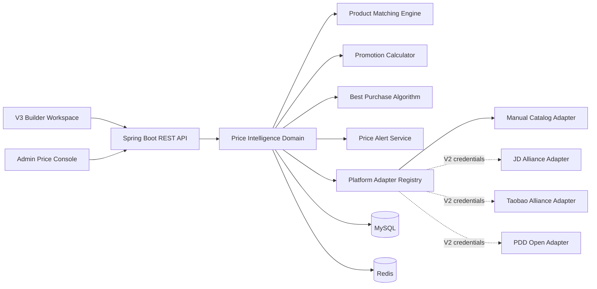

# PC LAB 3D Price Intelligence V1.0 重整设计

状态：用户已批准，按完整垂直闭环实施
日期：2026-08-02
基线：`pc-lab-hardware-intelligence-v1.0.0`
目标版本：`pc-lab-price-intelligence-v1.0.0`

## 1. 产品边界

PC LAB 3D 不是商城，也不承担下单、支付、履约或售后。价格模块是 Hardware
Intelligence 的购买决策层：识别标准硬件，匹配跨平台商品，计算真实到手价，评估报价
可信度，并通过受控跳转把用户送到平台页面。

V1.0 必须形成以下闭环：

```text
Builder 已选硬件
  -> 标准商品匹配
  -> 人工维护平台报价
  -> 到手价与可信购买排序
  -> 配置最低购买价 / 可节省金额
  -> 7 / 30 / 90 天趋势
  -> 匿名目标价提醒
  -> 受控购买跳转与点击事件
```

V1.0 不调用京东、淘宝、拼多多开放 API，不爬虫，不生成虚假实时价格。所有公开演示报价
明确标记为 `MANUAL_DEMO`，人工核验报价标记为 `MANUAL`。京东、淘宝、拼多多 Adapter
只保留可启用、无凭证时失败关闭的接口边界。

## 2. 方案选择

### A. 在现有 Price Domain 上重整（采用）

保留已经存在且有测试的 `product`、`product_price`、`price_history`、匹配引擎、人工后台、
点击跳转和缓存；新增 V7 迁移、物流评分、90 天趋势、匿名价格提醒，并把价格体验重新接入
当前 V3 Builder Workspace。

优点：迁移安全、既有报价不丢失、交付风险最低。缺点：需要修复旧 Builder 与新 Store 的
接口漂移。

### B. 拆分独立价格微服务

边界清晰，但当前硬件、配置、商品仍共享 MySQL，拆分会提前引入鉴权、分布式缓存与部署
复杂度，因此 V1 不采用。

### C. 仅做前端静态比价

无法保证商品匹配、价格历史、可信跳转和提醒一致性，不满足完整闭环，因此拒绝。

## 3. 系统架构



Price Service 继续作为 Spring Boot 模块化单体中的独立领域包。`PlatformAdapter` 是未来
拆服务边界，不在 V1 引入网络依赖。

## 4. 数据模型

现有 V3/V4 价格表继续作为基线，V7 只做向前兼容扩展。

### 4.1 `product`

继续保存标准硬件与平台商品身份：`hardware_id`、`title`、`brand`、`model`、`category`、
`image_url`、规格 JSON、匹配置信度、审核状态、来源和版本。新增可选
`image_fingerprint VARCHAR(128)`，用于人工导入的相同图片证据；不在浏览器端下载平台图片。

### 4.2 `product_price`

继续保存平台、商家、售价、优惠、运费、评分、销量、库存、链接、来源和检查时间。新增：

| 字段 | 类型 | 说明 |
|---|---|---|
| `delivery_score` | `DECIMAL(5,2)` | 0–100 的物流/履约评分，人工维护，默认 70 |
| `delivery_note` | `VARCHAR(160)` | 例如“京东物流 / 次日达”，只展示已核验内容 |

所有到手价仍由服务端重新计算：

```text
finalPrice = max(
  0,
  salePrice - coupon - fullReduction - memberDiscount - platformSubsidy
) + shipping
```

### 4.3 `price_history`

保留不可变价格快照。新增报价或到手价变化时写入；非价格字段更新不得制造趋势点。查询支持
`7D`、`30D`、`90D`，按日期输出当天最低到手价和有效报价数。

### 4.4 `price_alert`

V1 没有用户账户，因此使用匿名浏览器所有者令牌：前端生成随机 UUID，只在本地保存；服务端
只保存盐化 SHA-256。

| 字段 | 类型 | 说明 |
|---|---|---|
| `id` | `BIGINT UNSIGNED` | 主键 |
| `public_id` | `CHAR(36)` | 公共提醒 ID，唯一 |
| `owner_hash` | `CHAR(64)` | 匿名所有者散列 |
| `hardware_id` | `BIGINT UNSIGNED` | 标准硬件 |
| `target_price` | `DECIMAL(12,2)` | 目标到手价 |
| `current_best_price` | `DECIMAL(12,2) NULL` | 最近检测最低价 |
| `status` | `VARCHAR(20)` | `ACTIVE/TRIGGERED/PAUSED` |
| `triggered_at` | `DATETIME(3) NULL` | 首次达标时间 |
| `checked_at` | `DATETIME(3) NULL` | 最近检测时间 |
| `created_at/updated_at` | `DATETIME(3)` | 审计时间 |

唯一约束为 `(owner_hash, hardware_id)`。同一浏览器再次设置会更新目标价，而不是制造重复提醒。
V1 通知方式为 Builder 内“已达目标价”状态；邮件、短信、推送属于用户系统阶段。

### 4.5 行为事件隐私

购买点击生成独立 `event_id`，会话标识、IP 与 User-Agent 只保存盐化散列。搜索事件同样保存
匿名会话散列，不保存原始会话令牌。跳转链接只允许 HTTPS 与平台白名单域名。

## 5. 商品匹配

分类冲突直接拒绝。其余维度输出独立分数、命中 token 与冲突原因：

| 维度 | 权重 |
|---|---:|
| 型号 | 45% |
| 品牌 | 20% |
| 关键规格 | 20% |
| 标题关键词 | 10% |
| 图片指纹证据 | 5% |

图片指纹缺失时不作为负分，剩余权重重新归一；存在且冲突时进入人工复核。阈值：

- `>= 0.88`：允许自动建议匹配；
- `0.65–0.8799`：必须人工确认；
- `< 0.65`：禁止公开推荐。

配件词、二手/拆机词、型号家族冲突继续执行硬惩罚。公开报价只接受 `CONFIRMED` 商品。

## 6. Platform Adapter

统一接口提供：

```text
adapterCode()
isEnabled()
supportedPlatforms()
searchProduct(request)
getPrice(reference)
getDetail(reference)
getSeller(reference)
getLink(reference)
```

`ManualCatalogAdapter` 是 V1 唯一启用实现。JD/Taobao/PDD 适配器使用独立配置前缀；缺少
开放平台凭证时 `isEnabled=false`，不会联网、不会返回模拟报价。Registry 只暴露启用适配器。

## 7. 最佳购买算法

最低价与推荐价严格分离。先执行公共安全门槛：已确认匹配、有库存、到手价大于零、链接通过
白名单、报价未过期。

```text
score =
  priceScore    * 40%
  + sellerTrust * 25%
  + salesScore  * 15%
  + ratingScore * 10%
  + delivery    * 10%
```

销量继续使用 `log1p` 归一，避免头部销量支配全部结果。报价过期会降低综合分并显示 STALE，
但不会伪装成刚更新。结果必须解释价差、商家信誉、评价、销量和物流贡献。

## 8. API

公共接口：

| 方法 | 路径 | 说明 |
|---|---|---|
| GET | `/api/price-intelligence/hardware/{idOrKey}` | 报价与最低/推荐方案 |
| GET | `/api/price-intelligence/hardware/{idOrKey}/history?range=90D` | 趋势 |
| POST | `/api/price-intelligence/build/quote` | 整机内部价、最低价、推荐价和节省额 |
| GET | `/api/price-intelligence/offers/{offerId}/go` | 记录点击后 302 |
| PUT | `/api/price-intelligence/alerts/{hardwareKey}` | 创建或更新匿名提醒 |
| GET | `/api/price-intelligence/alerts` | 按匿名所有者读取提醒 |
| DELETE | `/api/price-intelligence/alerts/{publicId}` | 取消提醒 |
| POST | `/api/price-intelligence/search-events` | 匿名搜索事件 |

提醒接口使用 `X-Price-Alert-Owner`，只接受 UUID；该值不写 URL、不回传数据库散列。

Admin 继续使用 `X-Admin-Key`，覆盖商品、匹配预览、报价、历史和仪表盘。报价 DTO 增加物流
评分与说明；Admin 不允许直接提交 `finalPrice` 或 `matchConfidence`。

## 9. Builder 体验

### 9.1 右侧 Build Price Summary

当前 `PriceCard` 保留内部参考价和预算状态，并升级为两层信息：

- 内部配置价；
- 跨平台最低购买总价；
- 推荐商家组合总价；
- 可节省金额与已覆盖组件数；
- `查看购买方案` 主入口。

网络失败只降级到内部价，不阻塞装机和 3D Viewer。

### 9.2 Price Intelligence Panel

桌面使用与 Builder 同一石墨工作台语言的宽模态面板；移动端为全屏 Bottom Sheet。默认打开
GPU，可在已选组件间切换。信息层级：

1. 最低到手价与趋势状态；
2. `推荐购买` 与 `绝对最低` 两个明确标签；
3. 可信报价卡片（平台、卖家、优惠、运费、物流、评分、更新时间）；
4. 7/30/90 天趋势；
5. 目标价提醒；
6. 人工数据与跳转披露。

组件命名：`PricePanel`、`PriceOfferCard`、`PriceTrendChart`、`DealBadge`、
`SavingIndicator`、`PriceAlertControl`。不使用商品瀑布流、促销红色或商城式“抢购”文案。

### 9.3 交互状态

- Loading：保留卡片骨架，不清空旧数据；
- Updated：显示校验时间；
- Price Drop：只在当前最低价低于上一趋势点时出现；
- Stale：提示“待重新核验”，不参与首选推荐；
- Empty：解释人工报价尚未覆盖；
- Error：保留内部价并允许重试；
- Alert Triggered：在 Price Card 与提醒控制中同步显示。

## 10. Admin 体验

`/admin/prices` 继续采用人工闭环：商品身份 -> 匹配预览 -> 人工确认 -> 报价与优惠 ->
服务端到手价 -> 历史快照。新增物流评分、物流说明和提醒覆盖指标。Admin Key 仅在
`sessionStorage` 保存。

## 11. 缓存、调度与错误处理

- 报价摘要 5 分钟、历史 15 分钟、整机报价 2 分钟、提醒列表 2 分钟；
- 商品、报价、匹配或提醒更新在事务提交后精确失效关联缓存；
- 每小时检查热门报价与 ACTIVE 提醒，每日检查普通报价；
- Redis 不可用时回退 MySQL；
- 单个 Adapter 失败不得影响人工目录；
- 所有错误沿用 `ApiResponse`、稳定错误码和 Trace ID；
- 外链策略失败返回领域错误，不执行跳转、不记录成功点击。

## 12. 验收

1. 旧内部价格数据和已有商品/历史在 V7 后仍可查询；
2. 商品匹配返回可解释维度，误匹配配件/二手商品会被拒绝；
3. 排名权重严格为 40/25/15/10/10，最低价与推荐价可不同；
4. Builder 显示内部价、最低购买价、推荐组合价和节省额；
5. 7/30/90 天趋势均能查询和切换；
6. 匿名提醒可创建、更新、列出、触发和取消；
7. 购买跳转通过域名白名单并记录匿名事件；
8. `/admin/prices` 可以完成人工商品、报价、优惠、物流与历史维护；
9. 1440、1024、390 三种视口没有水平页面溢出，键盘与触控目标可用；
10. 前后端测试、类型检查、生产构建、真实 MySQL/Redis 联调和视觉验收通过；
11. 不调用联盟 API，不爬虫，不进入 AI 智能优化阶段。
